<div align="center">

# 🟧 MCOS — Minecraft Server OS

**Yalnızca Minecraft sunucuları yönetmek için tasarlanmış özel bir Linux dağıtımı.**

GUI yok, şişkinlik yok, dikkat dağıtacak hiçbir şey yok — sadece bir USB'ye yazıp boot ettiğiniz, açılır açılmaz sizi bulut kalitesinde bir sunucu paneliyle karşılayan saf bir sunucu işletim sistemi.


<br>

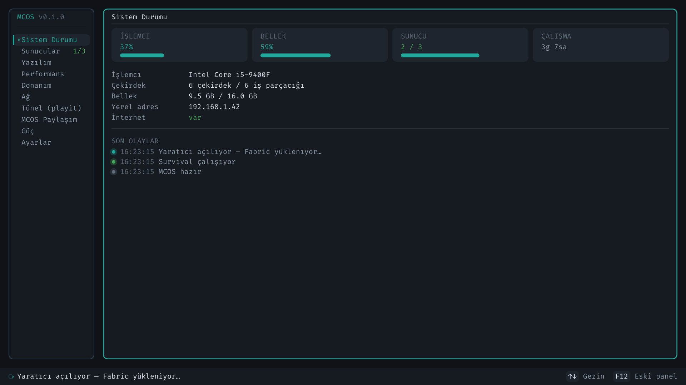

<sub><i>MCOS paneli — 1920×1080. Buradaki hiçbir çerçeve, çizgi veya işaret karakterle çizilmemiştir.</i></sub>

</div>

---

## 📑 İçindekiler

- [MCOS Nedir?](#-mcos-nedir)
- [1.0.1'de Yeni Neler Var?](#-101de-yeni-neler-var)
- [Açılıştan Panele](#-açılıştan-panele)
- [Arayüz](#-arayüz)
- [Fare ve Touchpad](#️-fare-ve-touchpad)
- [İlk Kurulum Sihirbazı](#-ilk-kurulum-sihirbazı)
- [PC Eşleştirme ve Ortak Dünya](#-pc-eşleştirme-ve-ortak-dünya)
- [Telefondan Yönetim (Android)](#-telefondan-yönetim-android)
- [SSH ile Bağlanma](#-ssh-ile-bağlanma)
- [İkinci PC'yi Düğüm Yapmak (mcos-node)](#️-ikinci-pcyi-düğüm-yapmak-mcos-node)
- [İnternete Açma (playit)](#-internete-açma-playit)
- [Masaüstünden USB'ye Kurulum](#-masaüstünden-usbye-kurulum)
- [Öne Çıkan Özellikler](#-öne-çıkan-özellikler)
- [Mimari](#️-mimari)
- [Durum ve Yol Haritası](#-durum-ve-yol-haritası)
- [Sanal Makinede Çalıştırma](#️-sanal-makinede-çalıştırma-virtualbox--qemu)
- [ISO Derleme](#-iso-derleme)
- [Sunucu Oluşturma Sihirbazı](#-sunucu-oluşturma-sihirbazı)
- [Eklenti / Mod Kataloğu](#-eklenti--mod-kataloğu)
- [Temalar, Kaynak Bütçesi ve Parola](#-temalar-kaynak-bütçesi-ve-parola)
- [Yedekleme ve Otomatik Kurtarma](#-yedekleme-ve-otomatik-kurtarma)
- [Geliştirici Rehberi](#️-geliştirici-rehberi)
- [JSON-RPC API](#-json-rpc-api)
- [SSS](#-sss)
- [Lisans](#-lisans)

---

## 🎮 MCOS Nedir?

MCOS, bir Minecraft sunucusunu kurmak, çalıştırmak, izlemek, yedeklemek ve internete açmak için ihtiyaç duyduğunuz **her şeyi** içeren; bunun **dışında hiçbir şey** içermeyen bir işletim sistemidir.

- **Tek amaçlı (appliance):** Masaüstü, tarayıcı, ofis programı yok. Açılış doğrudan sunucu paneline düşer.
- **glibc tabanlı RootFS:** Temurin/Oracle JDK tarball'ları ek uğraş olmadan sorunsuz çalışsın diye `glibc` ile derlenmiştir.
- **Daemon merkezli:** Tüm iş `mcosd` (Go) tarafından yürütülür; arayüzler (framebuffer panel, hafif Rust panel, CLI) sadece JSON-RPC istemcisidir.
- **Taşınabilir:** Diski/USB'yi başka bir PC'ye taktığınızda donanım değişikliğini algılar ve ilk kurulum sihirbazını yeniden başlatır.

> [!NOTE]
> MCOS bir Minecraft *istemcisi* değildir — oyunu oynamak için kullanılmaz. Yalnızca **sunucu** tarafını yönetir.

---

## ✨ 1.0.1'de Yeni Neler Var?

| | Yenilik |
|---|---|
| 🎬 | **Açılış animasyonu** — servisler başlarken logo, nefes alan hâle ve ilerleme halkası; panel o kareden **yakınlaşarak** açılır |
| 🖱️ | **Fare ve touchpad desteği** — tıklama, üzerine gelme, tekerlek, dokunarak tıklama, iki parmakla kaydırma |
| 💫 | **Geçiş efektleri** — ekranlar arası kayma + soluklaşma, açılır pencere arkasında gerçek bulanıklık |
| 🧭 | **Yeniden yazılmış kurulum sihirbazı** — 10 sayfa, adım göstergesi, artık yeni arayüzün içinde |
| 🔗 | **MCOS Link** — birden çok bilgisayar **aynı dünyayı** çalıştırır; oyuncu sınırı geçince envanteriyle aktarılır |
| 📡 | **Etkin PC taraması** — modem multicast'i engellese bile cihazları bulur; bulunamazsa elle IP |
| 🌐 | **playit tüneli** — üç adımlı, ekranda anlatılan hesap bağlama akışı |
| 🔒 | **İsteğe bağlı panel parolası** — PBKDF2, uykudan uyanınca yeniden sorma seçeneği |
| 🧩 | **Sunucu oluşturma sihirbazı** yeni arayüze taşındı — `n` tuşu artık uyarı vermiyor |
| 💾 | **Masaüstü kurulum aracı** — Windows ve Linux'ta USB'ye kalıcı MCOS yazar; sunucu/tarayıcı gerekmez |
| 📶 | **Wi-Fi düzeltmesi** — `wireless-regdb` eklendi; "kart çalışıyor ama ağ görmüyor" sorunu giderildi |

---

## 🎬 Açılıştan Panele

<div align="center">

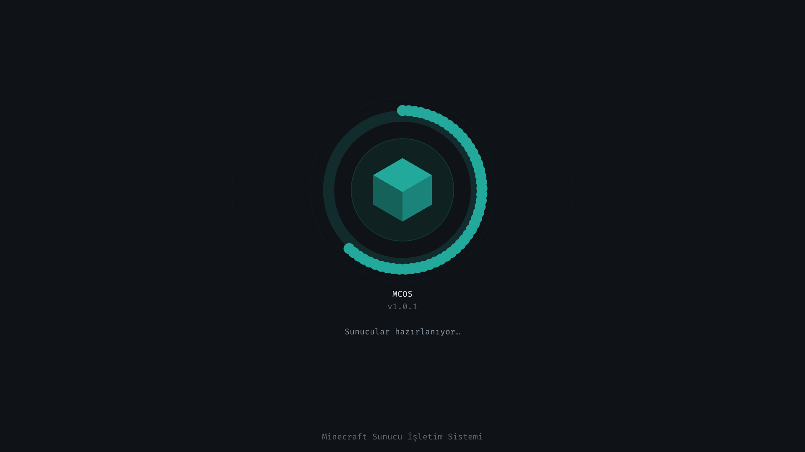

<sub><i>Açılış ekranı — servisler hazırlanırken ne olduğunu söyler ve makinenin donmadığını gösterir.</i></sub>

</div>

Açılış sırası:

```
 çekirdek  →  mcos-splash  →  mcosd + ağ + fontlar  →  panel
              (animasyon)      (durum satırı güncellenir)   ↑
                     └──────── son kare kaydedilir ─────────┘
                                                  yakınlaşarak açılır
```

Açılış ekranı **panel hazır olduğunda** kendiliğinden biter ve son karesini
`/run/mcos-splash.rgba` dosyasına bırakır. Panel o kareden **yakınlaşıp
bulanıklaşarak** kendi ilk ekranına geçer — ilk kurulumda bu, doğrudan
sihirbazın karşılama sayfasıdır.

> [!TIP]
> Animasyonu sevmiyorsanız **Ayarlar → Animasyonlar**'ı kapatın. Kapalıyken
> geçiş tamponları hiç ayrılmaz; zayıf makinelerde bellek de kazanırsınız.

---

## 🎨 Arayüz

MCOS'un arayüzü **doğrudan framebuffer'a** (`/dev/fb0`) çizilir. Arada terminal
öykünücüsü, pencere yöneticisi veya X11 yoktur.

### Neden bu kadar önemli?

Önceki sürüm bir **terminal** uygulamasıydı ve bu üç soruna yol açıyordu:

1. Köşeler gerçekten yuvarlak değildi — dört ayrı karakterdi ve font değişince kopuyordu.
2. Bazı işaretler gömülü fontta yoktu; yedek fonta düşmek satır hizasını kaydırıyordu.
3. Açılır pencerenin arkasını bulanıklaştırmak **imkânsızdı** — hücrenin "altı" diye bir şey yok.

Artık çerçeveler gerçek Bézier yayı, işaretler gerçek daire, bulanıklık gerçek bulanıklık.

### Ekranlar

<div align="center">

**Seçim ekranı** — Wi-Fi, disk, sürüm, tema… hepsi aynı pencereyi kullanır ve arka plan *durur*, sadece bulanıklaşır

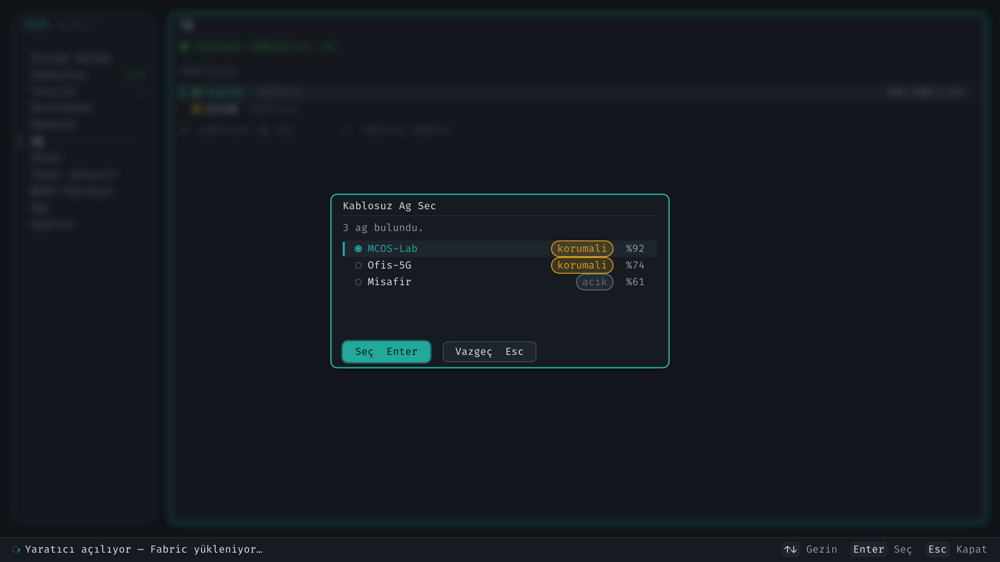

<br><br>

**MCOS Paylaşım** — bu makinenin adresi, bulunan cihazlar ve ortak dünya haritası

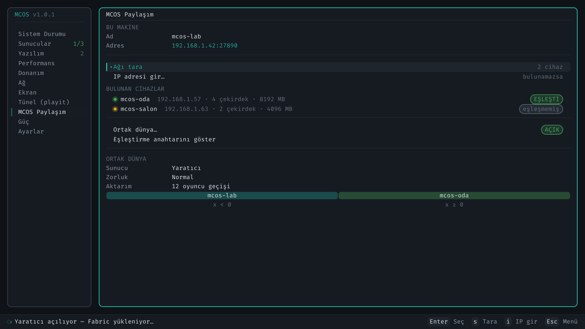

<br><br>

**Tünel (playit)** — üç adım, her birinin durumu ve ajan günlüğü

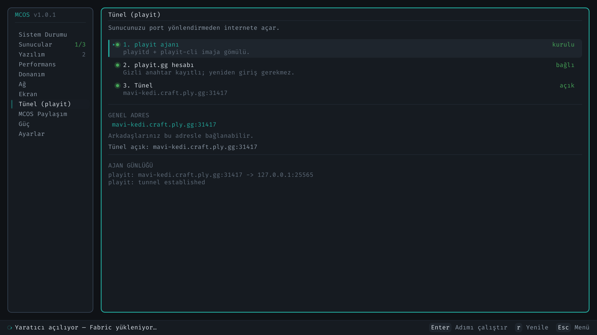

<br><br>

**Ayarlar** — her satırın sağında **şu anki değer**; bulunan işaretleme aygıtları altta

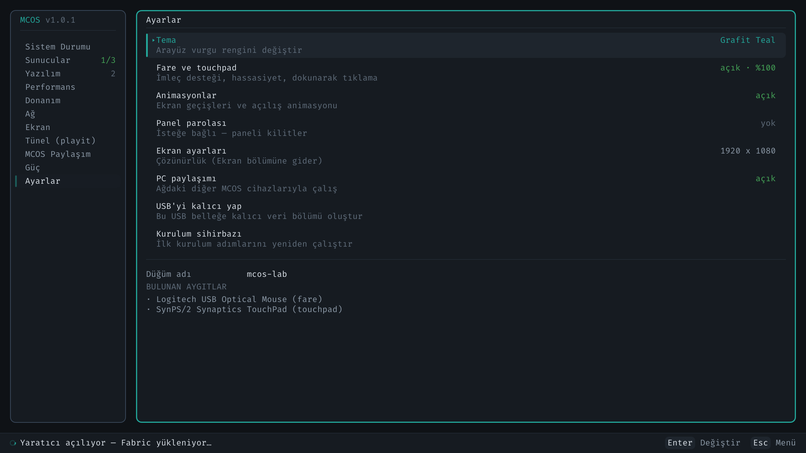

<br><br>

**Altı tema** — tema değişince *yalnızca vurgu rengi* değişir; tamam/uyarı/hata sabit kalır ki okunabilirlik bozulmasın

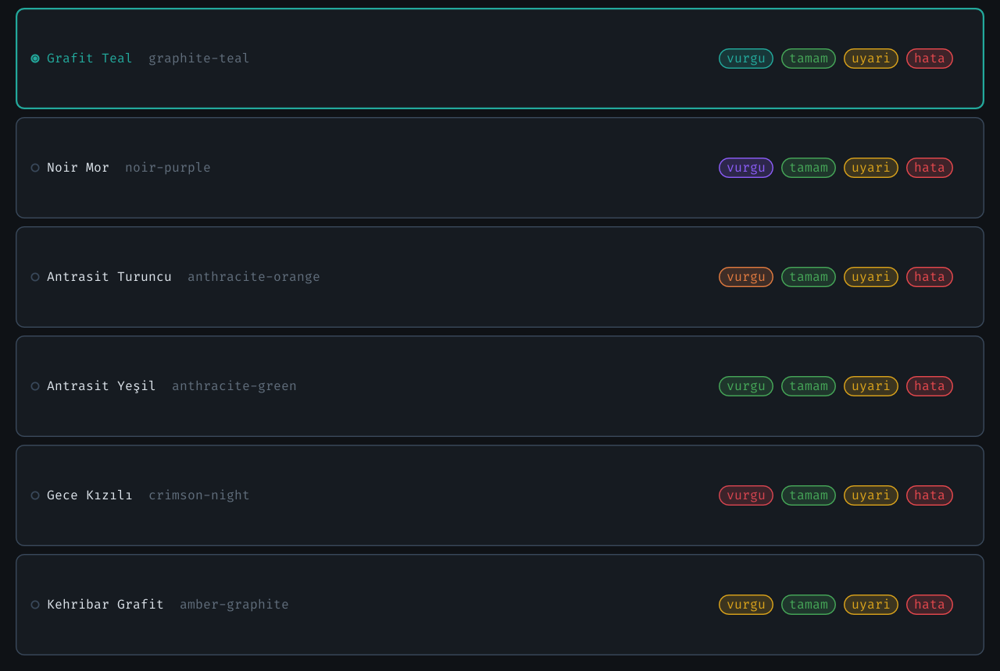

</div>

### Arayüzü kendiniz görün (donanım gerekmez)

```bash
make shots
```

Panelin **her ekranını**, her açılır penceresini, sihirbazın **on sayfasını** ve
açılış ekranını `dist/shots/` altına PNG olarak basar. Daemon çalışmıyorken
örnek veriyle çizer — tasarımı gözden geçirmek için birebir.

### Klavye

Tuş atamaları önceki sürümle **aynıdır**; kas hafızası bozulmaz.

| Tuş | Etki |
|---|---|
| `↑` `↓` / `k` `j` | Gezin |
| `Enter` / `→` / `l` | Seç, aç, başlat/durdur |
| `Esc` / `←` / `h` | Geri |
| `Tab` | Kenar çubuğu ↔ içerik |
| `n` | Yeni sunucu |
| `s` / `x` / `r` | Başlat / durdur / yenile |
| `s` *(Paylaşım ekranında)* | Ağı tara |
| `i` *(Paylaşım ekranında)* | Elle IP gir |
| `t` | Turbo |
| `g` | Güç menüsü (uyku, yeniden başlat, kapat) |
| `q` | Çıkış |
| **`F12`** | Eski panele dön (sorun çıkarsa kaçış yolu) |

---

## 🖱️ Fare ve Touchpad

<div align="center">
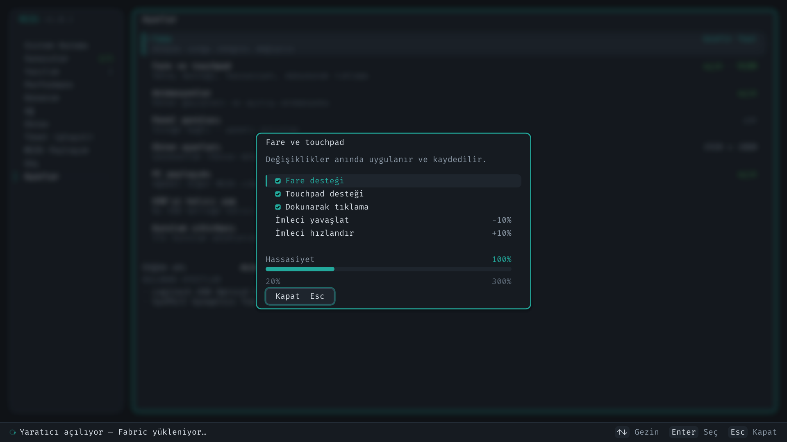
</div>

MCOS, `/dev/input/event*` aygıtlarını doğrudan okur ve **çekirdeğe yeteneklerini
sorar** (`EVIOCGBIT`). Aygıt adına bakmaz: "SynPS/2 Synaptics TouchPad",
"ELAN1200:00 04F3:3090 Touchpad" gibi onlarca biçim var ve üretici istediğini
yazabilir.

| Davranış | Nasıl çalışır |
|---|---|
| **Fare** | Bağıl hareket doğrudan piksele çevrilir; hassasiyet %20–%300 arası ayarlanır |
| **Touchpad** | Pad'in tamamını katetmek ekranın tamamını kateder; parmak her indiğinde referans sıfırlanır (**imleç zıplamaz**) |
| **Dokunarak tıklama** | 250 ms'den kısa, %4'ten az hareketli dokunuş = sol tık |
| **İki parmakla dokunma** | Sağ tık |
| **İki parmakla kaydırma** | Tekerlek |
| **Dokunmatik ekran** | Parmağın değdiği nokta imlecin gittiği yerdir |
| **Tek tık** | Menüde açar; listede yalnızca **seçer** |
| **Çift tık** | Listede çalıştırır |
| **Sağ tık** | Her yerde "geri" (pencereyi kapatır, menüye döner) |

> [!NOTE]
> **Neden listede tek tık çalıştırmıyor?** Satırlar yıkıcı olabilir (sunucu
> durdur, Java kaldır). Yanlışlıkla değen bir parmağın sunucuyu kapatması
> kabul edilemez. Menü (kenar çubuğu) güvenlidir; orada tek tık yeterli.

İmleç 8 saniye hareketsiz kalınca kaybolur — klavyeyle çalışırken ekranın
ortasında duran bir ok işareti dikkat dağıtır.

**Ayarlar → Fare ve touchpad** bölümünde fare ve touchpad **ayrı ayrı**
kapatılabilir (yazarken avuç içi teması rahatsız edenler için) ve bulunan
aygıtlar listelenir — "fare desteği açık ama çalışmıyor" şikâyetinin ilk
sorusu "sistem fareyi görüyor mu?"dur.

---

## 🧭 İlk Kurulum Sihirbazı

<div align="center">

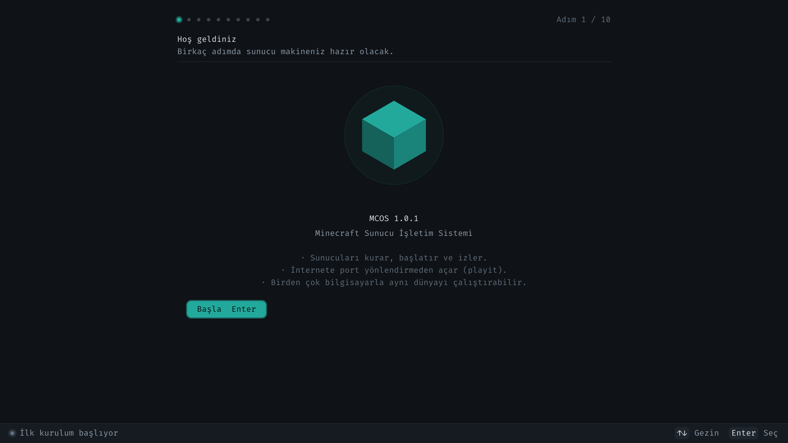

<br><br>

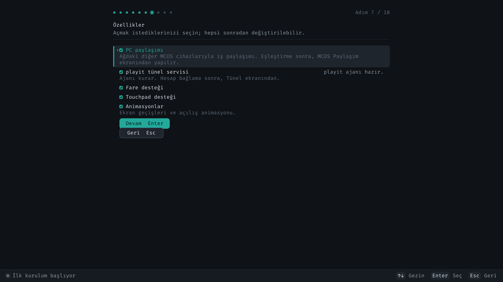

<br><br>

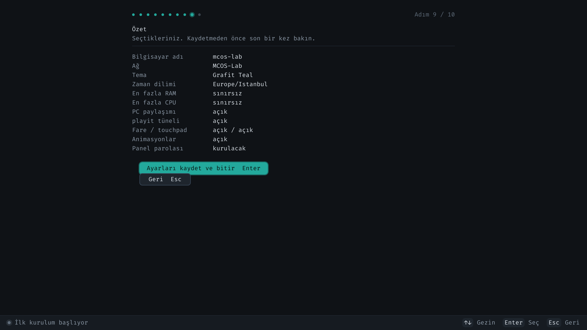

</div>

On sayfa, üstte adım göstergesi:

| # | Sayfa | Ne yapar |
|---|---|---|
| 1 | **Hoş geldiniz** | Açılış animasyonundan yakınlaşarak gelinen sayfa |
| 2 | **Bu bilgisayar** | Bulunan CPU/RAM/disk/ağ özeti (salt-okunur) |
| 3 | **Ad ve ağ** | Bilgisayar adı + Wi-Fi taraması ve bağlantısı (**hemen** uygulanır) |
| 4 | **Java** | Kurulu Java'yı denetler, yoksa Java 21'i kurar |
| 5 | **Görünüm** | Tema (anında önizleme) + zaman dilimi |
| 6 | **Kaynak sınırı** | Sunucu başına maks RAM ve CPU |
| 7 | **Özellikler** | PC paylaşımı, playit, fare, touchpad, animasyonlar |
| 8 | **Güvenlik** | İsteğe bağlı panel parolası (iki kez sorulur) |
| 9 | **Özet** | Her şey tek ekranda; **kaydet** |
| 10 | **Diske kur** | İsteğe bağlı kalıcı kurulum |

> [!IMPORTANT]
> **Sıra bilinçli: ÖNCE KAYDET, SONRA KUR.** Önceki sürümde kurulum adımı
> özetten önce geliyordu ve ayarları kaydeden tek fonksiyon hiç çalışmıyordu —
> kullanıcının girdiği Wi-Fi parolası, teması, düğüm adı kurulumdan sonra
> kayboluyordu. Artık `mcos-install` çalıştığında kalıcı bölüme **gerçek bir
> `config.json`** kopyalanır.

> [!NOTE]
> **PC eşleştirme sihirbazda YOKTUR** — yalnızca "açılsın mı?" sorusu vardır.
> Sebebi basit: ilk kurulumda öbür makine henüz kurulmamıştır, liste her zaman
> boştur ve kullanıcı özelliğin bozuk olduğunu sanır. Eşleştirmenin kendisi
> **MCOS Paylaşım** ekranında yapılır.

**Ayarlar → Kurulum sihirbazı** ile istediğiniz zaman yeniden çalıştırabilirsiniz;
çalışan sunucular durdurulmaz.

---

## 🔗 PC Eşleştirme ve Ortak Dünya

### Eşleştirme

Aynı ağdaki MCOS cihazları UDP çok noktaya yayınla birbirini bulur. Ama ev
modemlerinin çoğunda **istemci yalıtımı** varsayılan olarak açıktır ve
multicast geçmez. Bu yüzden MCOS **etkin tarama** da yapar: her adrese tek tek
TCP ile bağlanmayı dener.

```
  MCOS Paylaşım ekranı
  ├─ Ağı tara            ← etkin tarama, radar animasyonu
  ├─ IP adresi gir…      ← tarama bulamazsa çıkış yolu
  ├─ ● mcos-oda    …     [EŞLEŞTİ]
  ├─ ○ mcos-salon  …     [eşleşmemiş]
  ├─ Ortak dünya…        [AÇIK]
  └─ Eşleştirme anahtarını göster
```

Eşleştirme **otomatik değildir**: tarama bir güven işlemi sayılmaz. Bulunan
cihaz listelenir, eşleştirmeyi siz onaylarsınız. İki makinede **aynı
eşleştirme anahtarı** bulunmalıdır (ekranda gösterilir).

### Ortak dünya (MCOS Link)

Birden çok bilgisayar **aynı dünyayı** çalıştırır. Dünya X ekseninde
dilimlere bölünür ve her cihaz kendi dilimini simüle eder:

```
        mcos-lab                                   mcos-oda
  ┌───────────────────────┐                 ┌───────────────────────┐
  │  dünyanın sol yarısı  │   oyuncu →      │  dünyanın sağ yarısı  │
  │       x < 0           │  ═══════════►   │       x ≥ 0           │
  └───────────────────────┘   aktarım       └───────────────────────┘
```

Oyuncu sınırı **32 blok** aştığında:

1. sunucu oyuncunun kayıt dosyasını (`playerdata/<uuid>.dat`) yazar,
2. o dosyayı hedef cihaza gönderir ve **onay bekler**,
3. istemciye Minecraft'ın kendi **transfer paketini** yollar.

İstemci dünya ekranından hiç çıkmadan öbür sunucuya bağlanır; envanter, can,
XP, konum ve efektler yerinde kalır. **İstemcide mod gerekmez** — bu, oyunun
1.20.5'te eklediği gerçek bir özelliktir.

| Özellik | Durum |
|---|---|
| Kesintisiz aktarım (envanter dahil) | ✅ |
| Sınırsız cihaz (2, 3, 10…) | ✅ |
| Ortak sohbet ve oyuncu sayısı | ✅ |
| Zorluk tüm düğümlerde eşitlenir | ✅ |
| Sınıra yaklaşınca uyarı | ✅ |
| `/mcoslink` komutları (durum, harita, elle aktarım) | ✅ |
| Komşu dilimdeki **yapıların** karşı taraftan görünmesi | ❌ |

> [!WARNING]
> **Dürüst sınır:** her cihaz kendi diliminin blok verisini tutar. Aynı
> tohumdan aynı arazi üretilir, ama komşunun inşa ettiği ev sınırın diğer
> tarafından bakıldığında görünmez. Oyuncu sınırı geçtiğinde aktarılır ve
> yapıyı **yerinde** görür. Redstone ve varlıklar sınırı geçemez.
>
> Bunu çözmek dağıtık bir chunk deposu gerektirir; MCOS Link bunu **iddia
> etmiyor**. İddia ettiği şey tek bir dünyada, birden çok makinede, kesintisiz
> oynanabilirlik.

Ayrıntılar: [`mods/mcos-link/README.md`](mods/mcos-link/README.md)

```bash
make mod     # mcos-link.jar derler → dist/mods/
```

---

## 📱 Telefondan Yönetim (Android)

Sunucunuzu telefondan yönetin: durum, başlat/durdur, canlı konsol ve SSH
terminali.

### Nasıl bağlanılır

1. **MCOS panelinde:** `Ayarlar → Uzaktan kontrol → Uzaktan kontrolü aç`
   Ekranda **adres**, **port** ve **jeton** görünür.
2. **Telefonda:** uygulamayı aç → *MCOS ekle* → bu üçünü gir → **Bağlan**.

```
   MCOS paneli                          Telefon
   ┌──────────────────────────┐         ┌──────────────────┐
   │ Uzaktan Kontrol          │         │  Adres  192.168… │
   │                          │  ───▶   │  Port   2223     │
   │  Adres : 192.168.1.20    │         │  Jeton  4c5ca64e…│
   │  Port  : 2223            │         │                  │
   │  Jeton : 4c5ca64e 9b2f…  │         │    [ Bağlan ]    │
   └──────────────────────────┘         └──────────────────┘
```

### Güvenlik

| Konu | Nasıl |
|---|---|
| Taşıma | **TLS zorunlu.** Düz HTTP isteği servis edilmez. |
| Sunucunun kimliği | Sertifika parmak izi telefonda **sabitlenir**. Değişirse bağlantı reddedilir. |
| Jeton | 128 bit rastgele, her istekte, sabit süreli karşılaştırma. |
| Varsayılan | **Kapalı.** Kullanıcı açıkça açana kadar hiçbir port dinlenmez. |
| Kaba kuvvet | IP başına yavaşlatma. |

Jetonu yenilemek (`Jetonu yenile`) bağlı bütün telefonların erişimini keser.

### Komut satırından

Uygulama ayrı bir API kullanmıyor — panelin JSON-RPC yüzeyinin aynısı:

```bash
curl -k https://192.168.1.20:2223/health

curl -k -X POST https://192.168.1.20:2223/rpc \
  -H "Authorization: Bearer <jeton>" \
  -d '{"jsonrpc":"2.0","id":1,"method":"system.status"}'
```

> **Uygulama derlenmedi.** Flutter SDK geliştirme makinesinde kurulu
> olmadığı için `app/mcos_app` yazıldı ama hiç derlenmedi. Sunucu tarafı
> (`/health`, `/rpc`) gerçek daemon'a karşı sınandı. Ayrıntı ve beklenen
> ilk hatalar: [`app/mcos_app/README.md`](app/mcos_app/README.md).

---

## 🔑 SSH ile Bağlanma

Panelin yapamadığı işler için kabuk erişimi.

```
Ayarlar → SSH → önce "Parola koy" → sonra "SSH'ı aç"
```

Sonra bilgisayarınızdan:

```bash
ssh root@192.168.1.20
```

- Sunucu anahtarları **kalıcı** klasörde tutulur — her açılışta değişmez,
  yani istemciniz "anahtar değişti" uyarısı vermez.
- Parola `/etc/shadow`'a yazılır, **`config.json`'a değil**: yapılandırma
  dosyasını yedekleyen biri kabuk erişimi kazanmamalı.
- Parolasız ve anahtarsız SSH **açılmaz** — giremeyeceğiniz bir kapıyı açık
  bırakmanın anlamı yok.
- İmajda OpenSSH varsa o, yoksa dropbear kullanılır.

---

## 🖥️ İkinci PC'yi Düğüm Yapmak (mcos-node)

MCOS kurmak istemediğiniz bir Windows/Linux bilgisayarı ortak dünyaya
katın. Programı çalıştırmak yeterli.

```bash
make node            # Linux/macOS  → dist/node/mcos-node
make node-windows    # Windows      → dist/node/mcos-node.exe
```

Çalıştırınca:

```
  MCOS Düğüm v1.0.1
  ────────────────────────────────────────────────────────

  Bu makine   : salon-pc
  Adres       : 192.168.1.31:2222
  Durum       : ⠹ eşleştirme bekleniyor

  MCOS'ta:  Sol menü → PC Eşleştirme → Ağı tara
  Bulamazsa: "IP gir" → 192.168.1.31
```

1. MCOS panelinde `PC Eşleştirme → Eşleştirme anahtarı` ile anahtarı alın,
   programa bir kez girin.
2. MCOS'ta `Ağı tara` — bulunamazsa `IP gir`.
3. Eşleştikten sonra MCOS bu makineye ortak dünyanın yarısını kurar;
   Java'yı ve sunucu jar'ını kendisi indirir.

**Eşleştirme portu 2222**'dir; hem MCOS kutusu hem düğüm programı orayı
dinler, bu yüzden elle adres girerken port yazmanız gerekmez.

---

## 🌐 İnternete Açma (playit)

Sunucunuzu port yönlendirme yapmadan internete açmak için MCOS
[playit.gg](https://playit.gg) ajanını kullanır. **Üç adım**, hepsi ekranda:

| Adım | Ne olur |
|---|---|
| **1. Ajan** | İmaja gömülü `playitd` + `playit-cli` doğrulanır — internet gerekmez |
| **2. Hesap** | Ekranda bir kod ve adres çıkar; telefonunuzdan `playit.gg/claim/<kod>` açıp onaylarsınız |
| **3. Tünel** | Ajan başlar, tünelleri buluttan çeker, genel adres ekranda belirir |

> [!IMPORTANT]
> **2. adım atlanamaz.** playit, ajanı bir hesaba bağlamak için hesap
> sahibinin tarayıcıdan onay vermesini ister. Bu bir eksiklik değil, hesap
> sahipliği doğrulamasıdır. MCOS bunu gizlemek yerine ekranda açıkça söyler:
> kod ve adres büyük yazılır, yanında dönen bir bekleme göstergesi durur.
>
> Onayladıktan **sonra** her şey otomatiktir. Yeni tünelleri playit.gg
> sitesinden açarsınız; ajan yeniden başlatılmadan görür.

> [!NOTE]
> playit 1.0 ajanının yapılandırması **yalnızca gizli anahtarı** tutar;
> tüneller bulutta yaşar. İnternette dolaşan `[[mappings]]` örnekleri çok eski
> 0.15 sürümüne aittir ve çalışmaz.

---

## 💾 Masaüstünden USB'ye Kurulum

`mcos-flash`, MCOS'u masaüstünüzden (Windows veya Linux) doğrudan bir USB
belleğe **kalıcı** olarak kurar. Tarayıcı ve sunucu gerekmez.

```bash
make flash            # Linux aracı      → dist/flash/mcos-flash
make flash-windows    # Windows aracı    → dist/flash/mcos-flash.exe
```

Çalıştırmak için yanındaki başlatıcıyı kullanın — ikisi de yönetici/kök
hakkını **kendisi ister**:

| Sistem | Başlatıcı |
|---|---|
| Windows | `dist/flash/mcos-flash.bat` *(çift tıkla)* |
| Linux / macOS | `dist/flash/mcos-flash.sh` |

```
  ==============================================
    MCOS Flash 1.0.1
    Minecraft Sunucu İşletim Sistemi kurucusu
  ==============================================

  AYGITLAR
  ------------------------------------------------------------
   1) /dev/sdb               14.9 GB    SanDisk Ultra
   2) /dev/sdc               31.0 GB    Kingston DataTraveler
      ! Çıkarılabilir değil (dahili disk olabilir)

  Aygıt numarası [1-2]: _
```

### Güvenlik

| Koruma | Nasıl |
|---|---|
| **Sistem diski hiç listelenmez** | `--all-disks` ile bile. Kökün hangi diskte olduğu `/proc/mounts` (Linux) / birim uzantıları (Windows) ile bulunur |
| **Onay için yol yazılır** | "e/h" sorusu alışkanlık hâline gelir; `/dev/sdb` yazmak dikkat ister |
| **Yazmadan önce yeniden doğrulama** | Kullanıcı seçim yaparken belleği değiştirmiş olabilir |
| **Yazdıktan sonra geri okuma** | Önbellek boşaltılır, SHA-256 karşılaştırılır. Ucuz bellekler yazmayı "başarılı" bildirip veriyi yanlış yazar |
| **Windows'ta birim kilitleme** | `FSCTL_LOCK_VOLUME` + `FSCTL_DISMOUNT_VOLUME`; yapmayan araçlar ilk sektörleri yazıp gerisini sessizce atlar |
| **`--dry-run`** | Hiçbir aygıt **açılmaz** |

Kalıcı imajı üretmek için:

```bash
sh scripts/mkpersist.sh       # 3 bölümlü kalıcı imaj (kök hakkı GEREKMEZ)
```

---

## 🌟 Öne Çıkan Özellikler

| Alan | Özellik |
|------|---------|
| **Açılış** | Animasyonlu açılış ekranı; panel oradan yakınlaşarak açılır; durum satırı ne olduğunu söyler |
| **İlk Kurulum (OOBE)** | 10 sayfa, adım göstergesi, her şey yeni arayüzün içinde; **önce kaydeder sonra kurar** |
| **Giriş** | Klavye + fare + touchpad + dokunmatik ekran; hepsi ayarlardan kapatılabilir |
| **Sunucu Yazılımları** | Vanilla, Paper, Purpur, Spigot, CraftBukkit, Folia, Fabric, Forge, NeoForge, Quilt |
| **Sürüm Esnekliği** | Canlı sürüm listesi (Mojang) + elle giriş; **ViaVersion** ile eski istemci desteği |
| **Sunucu Sihirbazı** | Hızlı şablonlar, oyun ayarları, EULA onayı, otomatik indirme & kurulum |
| **Eklenti/Mod Kataloğu** | Modrinth API ile **anahtarsız** arama + tek tıkla kurulum |
| **PC Eşleştirme** | Etkin LAN taraması + elle IP; otomatik eşleştirme YOK (güvenlik) |
| **Ortak Dünya** | Birden çok cihaz aynı dünyayı çalıştırır; oyuncu sınırda kesintisiz aktarılır |
| **Tünel** | playit ajanı imaja gömülü; üç adımlı, ekranda anlatılan akış |
| **Güvenlik** | Online-mode varsayılan açık; isteğe bağlı panel parolası (PBKDF2); eşleştirme anahtarı |
| **Kaynak Yönetimi** | Sunucu başına RAM/CPU tavanı; cgroup v2 ile **gerçek** turbo modu |
| **Dayanıklılık** | Üstel backoff'lu supervisor; RPC panic-recovery; panel↔daemon otomatik yeniden bağlanma |
| **Yedekleme** | Zamanlanmış otomatik yedek + saklama; tam veya yalnız-dünya; tek tıkla geri yükleme |
| **6 Tema** | Grafit Teal, Noir Mor, Antrasit Turuncu, Antrasit Yeşil, Gece Kızılı, Kehribar Grafit |
| **Arayüz** | Framebuffer'a doğrudan vektör çizim; gerçek bulanıklık, 24 bit renk, geçiş animasyonları |

---

## 🏗️ Mimari

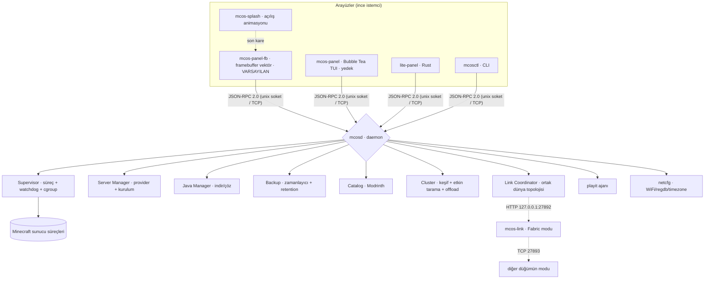

Panelin kendi çizim yığını (aşağıdan yukarı):

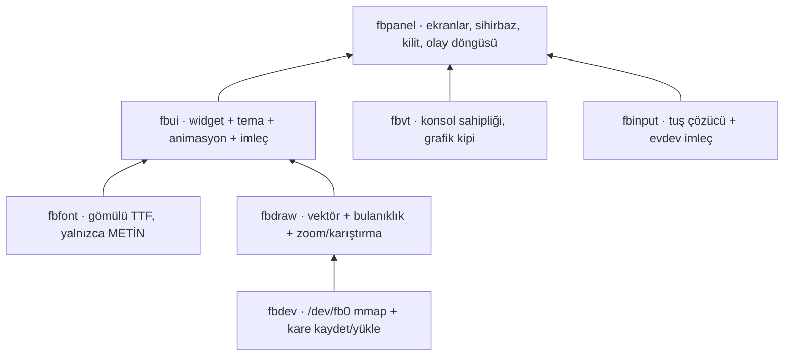

- **Tek ikili beyin:** `mcosd` store, supervisor, java, server, backup, files, worlds, players, cluster, link, tunnel ve netcfg alt sistemlerini birbirine bağlar.
- **Sözleşme:** Protokol `internal/ipc` altında tek yerde tanımlıdır; daemon istemcisi `internal/ipcclient` içindedir ve **her iki panel de aynı istemciyi kullanır**.
- **Sürüm tek kaynaktan:** `internal/version` — `scripts/test-version.sh` bunu doğrular.
- **Platform ayrımı:** OS'e özgü kod (`*_linux.go`, `*_windows.go`) yalnızca hedefte derlenir; geliştirici makinesinde güvenli no-op'lar devreye girer.
- **Font sözleşmesi:** Gömülü yazı tipi **yalnızca metin** çizer. Çerçeve, ikon, radyo düğmesi, onay kutusu, oklar ve **fare imleci** `fbdraw` tarafından vektör olarak çizilir.

---

## 📊 Durum ve Yol Haritası

> Bu bölüm **dürüst** tutulur: çalışan ile devam eden ayrı yazılır.

### ✅ Çalışıyor

| | Ne |
|---|---|
| ✅ | **Framebuffer vektör arayüzü** — 12 bölümün hepsi taşındı, yer tutucu kalmadı |
| ✅ | **Açılış animasyonu** + panele yakınlaşarak geçiş |
| ✅ | **Fare, touchpad, dokunmatik ekran** — tıklama, hover, tekerlek, tap-to-click |
| ✅ | **Geçiş animasyonları** — kayma + soluklaşma, kapatılabilir |
| ✅ | **Açılır pencere arkası bulanıklık** (1080p'de ~50 ms, önbellekli) |
| ✅ | **Kurulum sihirbazı** — yeni arayüzde, 10 sayfa, önce kaydeder |
| ✅ | **Sunucu oluşturma sihirbazı** — yeni arayüzde, 10 sayfa, sayfa başına doğrulama |
| ✅ | **İsteğe bağlı panel parolası** (PBKDF2 + uykuda kilit) |
| ✅ | **PC eşleştirme** — etkin tarama + elle IP + anahtar gösterimi |
| ✅ | **Ortak dünya** — dilim hesabı, aktarım, ortak sohbet, zorluk eşitleme |
| ✅ | **playit tüneli** — kurulum, hesap bağlama, ajan yönetimi |
| ✅ | **Masaüstü kurulum aracı** — Linux + Windows, doğrulamalı yazma |
| ✅ | **Diskten çalışma** — `switch_root` ile kalıcı kök |
| ✅ | **Turbo modu** — cgroup v2 ile gerçek etki |
| ✅ | **Wi-Fi** — `wireless-regdb` + düzenleyici alan ayarı |
| ✅ | **Türkçe klavye** — çekirdek düzeni uygular, `ığüşöç` sorunsuz |
| ✅ | **1920×1080** — ISO/USB/kurulu disk aynı listeyi kullanıyor |
| ✅ | **Güvenli kaçış yolu** — F12 veya kurtarma menüsünden eski panele dönüş |

### 🚧 Devam ediyor

| | Ne | Not |
|---|---|---|
| 🚧 | **Ortak dünyada blok senkronu** | Komşu dilimdeki yapılar sınırın öbür tarafından görünmüyor (bkz. yukarıdaki dürüst sınır notu) |
| 🚧 | **macOS flaşlama** | Aygıt listeleme ve ham yazma yalnızca Linux + Windows'ta |
| 🚧 | **Mod jar'ının imaja gömülmesi** | `make mod` gerekiyor; çevrimdışı pakete eklenecek |

> [!WARNING]
> Yeni arayüz **gerçek donanımda geniş çapta denenmedi**. Bir sorunla
> karşılaşırsanız kurtarma menüsünden **[5]** ile eski arayüze geçebilir veya
> `MCOS_PANEL=legacy` ortam değişkenini kullanabilirsiniz.

Ayrıntılı teknik devir notları: [`GECIS.md`](GECIS.md)

---

## 🖥️ Sanal Makinede Çalıştırma (VirtualBox / QEMU)

MCOS sanal makinede sorunsuz açılır, ama **varsayılan ayarlar yetmez**.

> [!IMPORTANT]
> **Bellek en az 2048 MB olmalı.** VirtualBox'ın "Other Linux (64-bit)"
> varsayılanı **512 MB**'dır ve MCOS bu değerde **açılmaz**.
>
> Sebep ölçüldü: initramfs sıkıştırılmış 128 MiB, açılmış 286 MiB. Çekirdek
> onu RAM'e açarken tepe kullanım init çalışmadan önce **~414 MiB**'a çıkar.
> 512 MB'da bu `Initramfs unpacking failed` ya da
> `Kernel panic - not syncing: Out of memory` ile biter.

| Ayar | Değer | Neden |
|---|---|---|
| **Bellek** | **≥ 2048 MB** | initramfs RAM'e açılır (yukarıdaki not) |
| **Ekran belleği (VRAM)** | **128 MB** | 1920×1080×32 çift arabellekli = 8,3 MB; varsayılan 16 MB yetersiz |
| **Ekran denetleyicisi** | VMSVGA *(varsayılan)* veya VBoxSVGA | ikisi de `simpledrm` ile çalışır |
| **Depolama** | ISO'yu **SATA/AHCI** denetleyicisine bağlayın | EFI açılışı IDE'de sorunlu |
| **I/O APIC** | Açık | 64-bit ve SMP için zorunlu |
| **Fare** | USB Tablet *(önerilen)* | Mutlak konum; PS/2 fare de çalışır |
| **EFI** | İsteğe bağlı | BIOS kipi daha sorunsuz |

**EFI kipinde çözünürlük:**

```bash
VBoxManage setextradata "MCOS" VBoxInternal2/EfiGraphicsResolution 1920x1080
```

**EFI kabuğuna düşerse:** ISO kökünde `startup.nsh` taşır; UEFI kabuğu onu
otomatik çalıştırıp GRUB'a geçer. Yine de takılırsa BIOS kipini kullanın.

---

## 🧱 ISO Derleme

ISO üretimi **Linux tabanlı bir ortam** gerektirir (Ubuntu veya WSL2). Altyapı **Buildroot 2024.02**'dir.

### 1) Bağımlılıklar (tek seferlik)

```bash
bash scripts/setup-wsl.sh
```

Elle kurmak isterseniz:

```bash
sudo apt-get install -y cpio unzip rsync bc wget gawk bison flex file build-essential xorriso
```

### 2) Derle ve dene

```bash
make offline-bundle   # Java + Fabric + Via + playit paketini indirir (bir kez)
make mod              # MCOS Link modunu derler (gradle, bir kez internet ister)
make iso              # → dist/mcos-x86_64.iso
make qemu             # üretilen ISO'yu QEMU'da boot eder
```

> [!IMPORTANT]
> Buildroot ilk derlemede bir araç zinciri kurar; **~10–15 GB boş disk** ister.
> `/mnt/c` üzerinde fakeroot sorunları çıkarsa:
> ```bash
> make iso BR_OUTPUT=$HOME/mcos-output
> ```

---

## 🧩 Sunucu Oluşturma Sihirbazı

<div align="center">

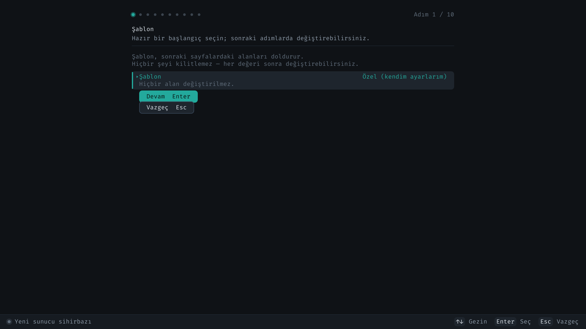

<br><br>

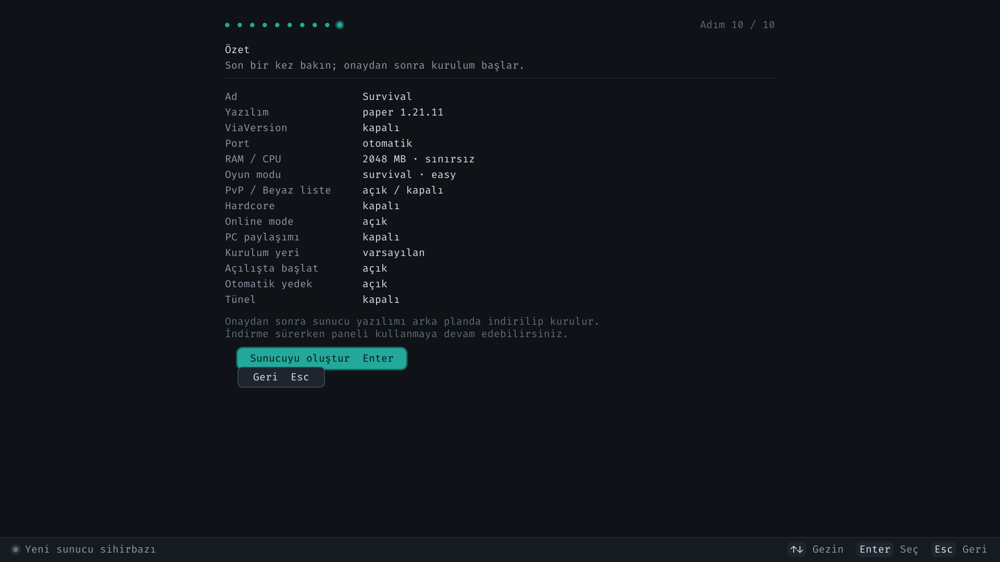

</div>

Panelde **`n`** ile açılır — hangi bölümde olursanız olun. On sayfa, ilk
kurulum sihirbazıyla **aynı** düzen ve aynı tuşlar:

| # | Sayfa | Ne seçilir |
|---|---|---|
| 1 | **Şablon** | `Survival (Paper)`, `Yaratıcı (Fabric)`, `Vanilla`, `Anarşi`, `Hardcore` veya `Özel` |
| 2 | **Ad** | Ad ve açıklama |
| 3 | **Sürüm** | Canlı Mojang listesi veya elle + **ViaVersion** anahtarı |
| 4 | **Altyapı** | Paper/Fabric/… (eklenti mi mod mu desteklediğini yazar) |
| 5 | **Ağ** | Port (0 = otomatik), görüş ve simülasyon mesafesi |
| 6 | **Oyun ayarları** | online-mode, oyun modu, zorluk, PvP, maks oyuncu, beyaz liste, hardcore, MOTD |
| 7 | **Kaynak** | RAM, CPU payı, algılanan GPU, **PC paylaşımı anahtarı** |
| 8 | **Kurulum yeri** | Özel klasör + otomatik başlat / yedek / tünel |
| 9 | **EULA** | Mojang lisans onayı (kabul etmeden ilerlenemez) |
| 10 | **Özet** | Her şey tek ekranda; onaydan sonra kurulum arka planda başlar |

Doğrulama **sayfa başına** yapılır: geçersiz bir port ya da oyuncu sayısı
hemen orada söylenir, dokuz sayfa sonra değil. Gönderimden önce hepsi bir
kez daha denetlenir — fareyle atlanmış bir sayfa varsa yakalanır.

> [!NOTE]
> Sunucu oluştururken **eş cihaz seçilmez**. Eşleştirme sunucuya değil
> MAKİNEYE aittir; yalnızca "PC paylaşımı kullanılsın mı?" anahtarı vardır.
> Hangi cihaza iş verileceğine daemon karar verir; uygun eş yoksa işler
> yerelde çalışır.

---

## 📦 Eklenti / Mod Kataloğu

Sunucu detayında **Yazılım/Eklentiler** sekmesi, anahtar gerektirmeyen **Modrinth API** üzerinden arama yapar:

- Sunucunun altyapısına ve sürümüne göre **uyumlu** sonuçlar filtrelenir.
- Tek tuşla kurulum: `plugins/`, `mods/` veya `world/datapacks/`.
- Tek tıkla **sürüm/altyapı değiştirme**: önce otomatik yedek alır, uygun Java'yı çözer, dünyayı koruyarak yeniden kurar.

---

## 🎨 Temalar, Kaynak Bütçesi ve Parola

<div align="center">

</div>

**6 koyu tema** (hiçbiri mavi-ağırlıklı değil). Tema değiştiğinde **yalnızca
vurgu rengi** değişir — "tamam / uyarı / hata" renkleri sabit kalır.

**Kaynak bütçesi** kurulumda belirlenir: sunucu başına maks RAM (MB) ve maks
CPU payı (%). Daemon bu tavanları **cgroup v2** ile gerçekten uygular; turbo
modu açıldığında sınırlar kaldırılır ve I/O önceliği yükseltilir.

**Panel parolası** isteğe bağlıdır:

- PBKDF2-SHA256, 200 000 tur, rastgele 16 baytlık tuz.
- Beş yanlış denemeden sonra 20 saniye bekleme.
- "Uykudan uyanınca sor" seçeneği.

> [!WARNING]
> Parola paneli kilitler, **diski şifrelemez**. Makineyi açıp diski çıkaran
> birine karşı koruma sağlamaz. MCOS bunu iddia etmiyor ve ayarlar ekranında
> da böyle yazıyor.

---

## 💽 Yedekleme ve Otomatik Kurtarma

- **Zamanlanmış yedek:** Sunucu başına süre (`6h` gibi) ve saklama sayısı.
- **Tür:** Tam veya yalnız-dünya. Tek tıkla geri yükleme.
- **Watchdog:** Çöken süreç üstel backoff ile yeniden başlatılır.
- **Panic-recovery:** Tek bir RPC handler paniği daemon'u düşürmez.
- **Reconnect:** Daemon yeniden başlasa bile panel çökmeden tekrar bağlanır.

---

## 🛠️ Geliştirici Rehberi

Proje Windows/macOS/Linux üzerinde derlenip test edilebilir (OS katmanı hariç).

```bash
# Tüm uygulamaları derle (host)
make app

# Testler + statik analiz
make test           # Go testleri
make vet
make test-boot      # 230+ mantık denetimi (diske DOKUNMAZ)

# Arayüzün her ekranını PNG olarak bas
make shots          # → dist/shots/

# Masaüstü flaşlama aracı
make flash          # Linux
make flash-windows  # Windows

# Minecraft modu
make mod            # → dist/mods/mcos-link.jar

# Yerel dev: daemon + panel
./bin/mcosd --data-root ./run --listen tcp://127.0.0.1:7777 &
./bin/mcos-panel-fb --connect tcp://127.0.0.1:7777
./bin/mcosctl --connect tcp://127.0.0.1:7777 status
```

> [!WARNING]
> **`go build ./...` KULLANMAYIN.** ISO bir kez derlendikten sonra
> `os/buildroot/output/build/*/gcc/testsuite` altında binlerce geçersiz `.go`
> dosyası oluşur ve derleme baştan kırılır. Makefile'daki
> `GO_PKGS := ./cmd/... ./internal/... ./panel/...` kapsamı kullanılmalıdır.

**Dizin yapısı (özet):**

```
cmd/            mcosd, mcos-panel, mcos-panel-fb, mcos-splash,
                mcos-flash (masaüstü), mcosctl, mcos-detect
internal/       daemon, ipc, ipcclient, model, store, server(+providers),
                java, supervisor, backup, files, worlds, players, cluster,
                tunnel, catalog, netcfg, sysmon, tier, log, portmgr, version
  ├─ fbdev/     framebuffer aygıtı + kare kaydet/yükle (geçiş için)
  ├─ fbfont/    gömülü TTF ile metin çizimi (YALNIZCA metin)
  ├─ fbdraw/    vektör çizim, bulanıklık, zoom/karıştırma, easing
  ├─ fbui/      widget, tema, alt çubuk, animasyon, imleç, logo
  ├─ fbvt/      sanal terminal sahipliği (grafik kipi + güvenli geri verme)
  ├─ fbinput/   tuş çözücü + evdev imleç (fare/touchpad/dokunmatik)
  ├─ fbpanel/   ekranlar, kurulum sihirbazı, kilit ekranı, olay döngüsü
  └─ flash/     blok aygıtı listeleme + doğrulamalı ham yazma
mods/mcos-link/ Fabric modu (ortak dünya)
panel/          Bubble Tea TUI (yedek arayüz)
lite-panel/     Rust hafif panel
os/buildroot/   Buildroot external tree (defconfig, paketler, init, overlay)
scripts/        derleme + test betikleri, lib/display.sh
docs/           gorseller/ (ekran görüntüleri), arastirma/ (analiz çıktıları)
```

**Test betikleri** (`make test-boot` hepsini çalıştırır):

| Betik | Neyi korur |
|---|---|
| `test-boot-logic.sh` | UEFI kernel panic'in geri gelmemesi, GRUB prefix ↔ grub.cfg uyumu |
| `test-display-logic.sh` | Çözünürlüğün ISO/USB/kurulu diskte aynı kalması |
| `test-panel-wiring.sh` | Panelin gerçekten bağlı olması + konsolun geri verilmesi |
| `test-install-logic.sh` | Kurulum betiğinin mantığı |
| `test-bootloader-embed.sh` | Gömülü GRUB imajlarının bütünlüğü |
| `test-disksig.sh` | MBR imzası → PARTUUID dönüşümü |
| `test-diskroot-logic.sh` | `switch_root` ile kalıcı kök |
| `test-vbox-compat.sh` | VirtualBox sürücüleri ve ISO seçenekleri |
| `test-wifi-logic.sh` | `wireless-regdb` + düzenleyici alan |
| `test-ui-logic.sh` | Fare, animasyon, açılış ekranı, kilit, sihirbaz |
| `test-link-logic.sh` | Go ↔ Java ortak dünya sözleşmesi |
| `test-flash-logic.sh` | Flaşlama aracının güvenlik değişmezleri |
| `test-version.sh` | Sürümün tek kaynaktan gelmesi |

---

## 🔌 JSON-RPC API

Tüm arayüzler newline ile ayrılmış JSON-RPC 2.0 konuşur. Önemli metotlar:

| Grup | Metotlar |
|------|----------|
| Sistem | `ping`, `system.status`, `system.turbo`, `system.disks`, `system.persist`, `config.get`, `config.set` |
| Sunucu | `server.list/get/create/delete/install/start/stop/restart/command/console`, `server.changeVersion`, `server.versions` |
| Katalog | `catalog.search`, `catalog.install` |
| Java | `java.list/install/resolve/remove/detect` |
| Yedek | `backup.list/create/restore/delete` |
| Dosya/Dünya | `files.list/read/write/delete`, `worlds.list/rename/delete` |
| Oyuncu | `players.list`, `players.command` |
| Cluster | `cluster.peers/pair/tasks`, **`cluster.scan`**, **`cluster.pairManual`**, **`cluster.secret`** |
| Ortak dünya | **`link.status/enable/disable/events`** |
| playit | **`playit.status/install/claim/poll/start/stop`** |
| Ağ | `net.wifiScan`, `net.wifiApply`, `net.wiredUp` |
| Tünel | `tunnel.list/create/resolve/start/stop` |

---

## ❓ SSS

**ISO ne kadar yer kaplar?** Tipik olarak ~80 MB; çevrimdışı paketle ~160 MB.

**Fare çalışmıyor, ne yapmalıyım?** **Ayarlar → Fare ve touchpad**'i açın ve
alttaki "Bulunan aygıtlar" listesine bakın. Liste boşsa sistem aygıtı hiç
görmüyordur (sanal makinede "USB Tablet" seçili mi?). Liste doluysa desteği
açın ve hassasiyeti artırın.

**Eski sürüm istemcileri bağlanabilir mi?** Evet — sürüm adımında **ViaVersion**'ı açın.

**İnternet yoksa ne olur?** Çevrimdışı paket varsa sunucu kurulabilir; sürüm
listesi yerel yedeğe düşer, tünel pasifleşir.

**Ortak dünyada arkadaşım evimi göremiyor.** Beklenen davranış — bkz.
[dürüst sınır notu](#-pc-eşleştirme-ve-ortak-dünya). Sınırı geçtiğinde evi
yerinde görecek.

**Diski başka PC'ye taktım, ne olur?** Donanım parmak izi uyuşmadığı için
kurulum sihirbazı yeniden başlar.

**Parolamı unuttum.** Tek çözüm yeniden kurulumdur. Bu yüzden parola iki kez
sorulur ve isteğe bağlıdır.

**`make iso` "cpio bulunamadı" diyor.** `bash scripts/setup-wsl.sh` çalıştırın.

---

## 📄 Lisans

MIT. Gömülü yazı tipi FiraCode Nerd Font, SIL Open Font License 1.1 ile dağıtılır.
MCOS Link modu MIT lisanslıdır.

Minecraft sunucu `server.jar` dosyası **imaja gömülmez** — Mojang EULA'sı
yeniden dağıtımı ve aynalamayı yasaklar. İlk kurulumda bir kez indirilir ve
sonsuza dek önbelleklenir.
