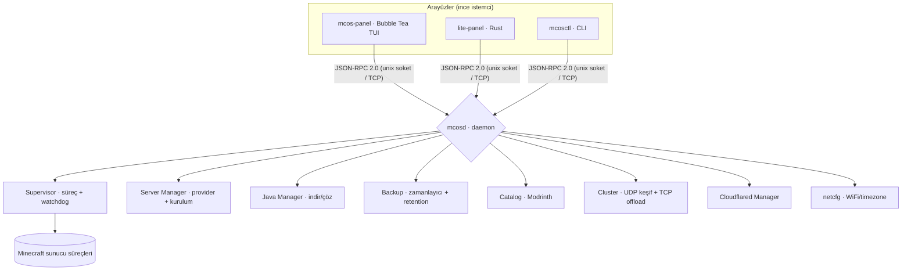

<div align="center">

# 🟧 MCOS — Minecraft Server OS

**Yalnızca Minecraft sunucuları yönetmek için tasarlanmış, terminal tabanlı özel bir Linux dağıtımı.**

GUI yok, şişkinlik yok, dikkat dağıtacak hiçbir şey yok — sadece bir USB'ye yazıp boot ettiğiniz, açılır açılmaz sizi bulut kalitesinde bir sunucu paneliyle karşılayan saf bir sunucu işletim sistemi.


</div>

---

## 📑 İçindekiler

- [MCOS Nedir?](#-mcos-nedir)
- [Öne Çıkan Özellikler](#-öne-çıkan-özellikler)
- [Mimari](#️-mimari)
- [Yaklaşık ISO Boyutu](#-yaklaşık-iso-boyutu)
- [ISO Derleme](#-iso-derleme)
- [USB'ye Yazma ve İlk Açılış (OOBE)](#-usbye-yazma-ve-i̇lk-açılış-oobe)
- [Sunucu Oluşturma Sihirbazı](#-sunucu-oluşturma-sihirbazı)
- [Eklenti / Mod Kataloğu](#-eklenti--mod-kataloğu)
- [PC Eşleştirme ve Güç Paylaşımı](#-pc-eşleştirme-ve-güç-paylaşımı)
- [Cloudflare Tüneli ve 5 Haneli Kod](#-cloudflare-tüneli-ve-5-haneli-kod)
- [Temalar ve Kaynak Bütçesi](#-temalar-ve-kaynak-bütçesi)
- [Yedekleme ve Otomatik Kurtarma](#-yedekleme-ve-otomatik-kurtarma)
- [Geliştirici Rehberi](#-geliştirici-rehberi)
- [JSON-RPC API](#-json-rpc-api)
- [SSS](#-sss)
- [Lisans](#-lisans)

---

## 🎮 MCOS Nedir?

MCOS, bir Minecraft sunucusunu kurmak, çalıştırmak, izlemek, yedeklemek ve internete açmak için ihtiyaç duyduğunuz **her şeyi** içeren; bunun **dışında hiçbir şey** içermeyen bir işletim sistemidir.

- **Tek amaçlı (appliance):** Masaüstü, tarayıcı, ofis programı yok. Açılış doğrudan sunucu paneline düşer.
- **glibc tabanlı RootFS:** Temurin/Oracle JDK tarball'ları ek uğraş olmadan sorunsuz çalışsın diye `glibc` ile derlenmiştir.
- **Daemon merkezli:** Tüm iş `mcosd` (Go) tarafından yürütülür; arayüzler (TUI panel, hafif Rust panel, CLI) sadece JSON-RPC istemcisidir.
- **Taşınabilir:** Diski/USB'yi başka bir PC'ye taktığınızda donanım değişikliğini algılar ve ilk kurulum sihirbazını yeniden başlatır.

> [!NOTE]
> MCOS bir Minecraft *istemcisi* değildir — oyunu oynamak için kullanılmaz. Yalnızca **sunucu** tarafını yönetir.

---

## 🌟 Öne Çıkan Özellikler

| Alan | Özellik |
|------|---------|
| **İlk Kurulum (OOBE)** | 9 adımlı sihirbaz: tanıtım → sistem kontrolü → WiFi tara & bağlan → Java kur → tema → kaynak bütçesi → PC eşleştirme → (atlanabilir) ilk sunucu → onay |
| **Sunucu Yazılımları** | Vanilla, Paper, Purpur, Spigot, CraftBukkit, Folia, Fabric, Forge, NeoForge, Quilt |
| **Sürüm Esnekliği** | Canlı sürüm listesi (Mojang) + elle giriş; **ViaVersion** ile eski istemci desteği |
| **Sunucu Sihirbazı** | Hızlı şablonlar, oyun ayarları (gamemode/zorluk/PvP/online-mode/maks oyuncu/whitelist/hardcore/MOTD), EULA onayı, otomatik indirme & kurulum |
| **Eklenti/Mod Kataloğu** | Modrinth API ile **anahtarsız** arama + tek tıkla kurulum (`plugins/`, `mods/`, `datapacks/`) |
| **PC Eşleştirme** | Aynı ağdaki MCOS cihazları otomatik keşfeder; güçlü PC sunucuyu çalıştırır, zayıf PC yedek/log/optimizasyon işlerini üstlenir |
| **Cloudflare Tüneli** | Port açmadan dışarı erişim; uzun komutları **5 haneli kısa kodla** saklama; sunucu başlayınca tünel otomatik açılır, durunca kapanır |
| **Güvenlik** | Online-mode varsayılan açık; isteğe bağlı beyaz liste; WiFi parolaları `wpa_supplicant` ile yönetilir |
| **Kaynak Yönetimi** | Sunucu başına RAM/CPU tavanı (kaynak bütçesi); `nice`/CPU affinity ile öncelik; "tam performans" modu |
| **Dayanıklılık** | Çöken sunucuyu üstel backoff'la yeniden başlatan supervisor; RPC panic-recovery; panel↔daemon otomatik yeniden bağlanma |
| **Yedekleme** | Zamanlanmış otomatik yedek + saklama (retention); tam veya yalnız-dünya; tek tıkla geri yükleme |
| **5 Tema** | Noir Mor, Antrasit Turuncu, Antrasit Yeşil, Gece Kızılı, Kehribar Grafit — hepsi koyu, mavi-ağırlıklı değil |

---

## 🏗️ Mimari



- **Tek ikili beyin:** `mcosd` store, supervisor, java, server, backup, files, worlds, players, cluster, cloudflared ve netcfg alt sistemlerini birbirine bağlar.
- **Sözleşme:** Protokol `internal/ipc` altında tek yerde tanımlıdır; Rust hafif panel aynı JSON şekillerini konuşur.
- **Platform ayrımı:** OS'e özgü kod (`*_linux.go`) yalnızca hedefte derlenir; geliştirici makinesinde güvenli no-op'lar devreye girer; böylece proje Windows/macOS üzerinde de derlenip test edilebilir.

---

## 💾 Yaklaşık ISO Boyutu

ISO; bir Linux çekirdeği (`bzImage`), gzip'lenmiş bir `initramfs` (`rootfs.cpio.gz`) ve GRUB önyükleyiciden oluşur.

| Bileşen | Sıkıştırılmamış | ISO katkısı |
|---------|----------------:|------------:|
| Linux kernel (özel 6.6 config) | ~8 MB | ~8 MB |
| Go binarileri (`mcosd`+`mcos-panel`+`mcosctl`+`mcos-detect`) | ~17 MB | ~7 MB (gzip) |
| `cloudflared` (resmi statik ikili) | ~40 MB | ~14 MB (gzip) |
| Temel rootfs (glibc, busybox, OpenSSH, wpa_supplicant, e2fsprogs) | ~20–30 MB | ~9 MB (gzip) |
| GRUB + ISO (El Torito/xorriso) katmanı | — | ~10–16 MB |
| **Toplam `mcos-x86_64.iso`** | | **≈ 70–100 MB (tipik ~80 MB)** |

> [!TIP]
> En büyük tek bileşen `cloudflared`'dır. Tünel özelliğine ihtiyacınız yoksa `os/buildroot/external/configs/mcos_defconfig` içinden `BR2_PACKAGE_CLOUDFLARED=y` satırını kaldırarak ISO'yu ~15 MB küçültebilirsiniz.

---

## 🧱 ISO Derleme

ISO üretimi **Linux tabanlı bir ortam** gerektirir (Ubuntu veya Windows üzerinde WSL2). Altyapı **Buildroot 2024.02**'dir.

### 1) Bağımlılıklar (tek seferlik)

```bash
bash scripts/setup-wsl.sh      # Go + Rust + QEMU + cpio/unzip/rsync/bc/xorriso ...
```

`scripts/setup-wsl.sh` çalıştıramıyorsanız Buildroot'un ihtiyaç duyduğu host araçlarını elle kurun:

```bash
sudo apt-get install -y cpio unzip rsync bc wget gawk bison flex file build-essential xorriso
```

> [!NOTE]
> Makefile bir **preflight** kontrolü içerir: eksik host aracı varsa derleme baştan, anlaşılır bir mesajla durur (eski "cpio/unzip bulunamadı" kriptik Buildroot hatası artık yaşanmaz). Şifresiz `sudo` mevcutsa eksikleri otomatik kurar.

### 2) Derle ve dene

```bash
make iso     # preflight → Go binarilerini linux/amd64 çapraz derler → Buildroot → dist/mcos-x86_64.iso
make qemu    # üretilen ISO'yu QEMU'da seri konsolla (-nographic) boot eder
```

> [!IMPORTANT]
> Buildroot ilk derlemede bir araç zinciri kurar; bu işlem **~10–15 GB boş disk** ve internet bağlantısı ister. `/mnt/c` üzerinde fakeroot/symlink sorunları çıkarsa native WSL diskine yönlendirin:
> ```bash
> make iso BR_OUTPUT=$HOME/mcos-output
> ```

---

## 🚀 USB'ye Yazma ve İlk Açılış (OOBE)

Oluşan `dist/mcos-x86_64.iso` dosyasını **Rufus** veya **BalenaEtcher** ile bir USB belleğe yazıp hedef PC'de başlatın.

İlk açılışta (veya disk/USB başka bir donanıma takıldığında) **9 adımlı kurulum sihirbazı** çalışır:

1. **Tanıtım** — MCOS'in ne yaptığına dair kısa karşılama.
2. **Sistem Kontrolü** — algılanan CPU/RAM/disk/GPU ve ağ durumu (salt-okunur özet).
3. **Kimlik + WiFi** — PC adı; yakındaki ağları **tarar** (🔒 + sinyal %), SSID + parola ile **gerçekten bağlanır** (`wpa_supplicant` + DHCP).
4. **Java** — kurulu Java yoksa **Java 21'i otomatik indirip kurar**.
5. **Tema** — 5 koyu tema arasından seçim; renkler **anında** önizlenir.
6. **Kaynak Bütçesi** — sunucu başına maks RAM ve CPU tavanı (yeni sunucular bu sınırı aşamaz).
7. **PC Eşleştirme** — cluster aç/kapa + keşfedilen MCOS cihazlarını listeler.
8. **İlk Sunucu (atlanabilir)** — "Şimdi kur" derseniz onaydan sonra sunucu sihirbazı otomatik açılır.
9. **Onay** — her şey kaydedilir, WiFi uygulanır, tema devreye girer.

> [!NOTE]
> **"Farklı PC → kurulum" nasıl çalışır?** Kurulumda makinenin ağ kartı MAC adreslerinden bir **donanım parmak izi** üretilip kaydedilir. Açılışta `mcosd` bu parmak izini mevcut donanımla karşılaştırır; uyuşmuyorsa (USB yeni bir PC'ye takılmış demektir) sihirbazı yeniden başlatır. Aynı PC'de doğrudan ana panel açılır.

Ana ekran sade tutulur: üstte **"＋ Yeni Sunucu (n)"**, altında sunucu listesi. Bir sunucuya `Enter` ile girip konsol, oyuncular, dosyalar, dünyalar, yedekler ve eklenti sekmelerine ulaşırsınız.

---

## 🧩 Sunucu Oluşturma Sihirbazı

Panelde `n` ile açılır. Adımlar:

1. **Şablon** — `Survival (Paper)`, `Yaratıcı (Fabric)`, `Vanilla`, `Anarşi (Paper)`, `Hardcore (Vanilla)` veya `Özel`. Şablon makul varsayılanları doldurur.
2. **Ad / açıklama**
3. **Sürüm** — canlı Mojang listesinden seçin ya da elle yazın (eski sürümler için) + **ViaVersion** anahtarı.
4. **Altyapı** — Paper/Fabric/… (eklenti mi mod mu desteklediğini gösterir).
5. **Ağ** — port (0 = otomatik boş port), render distance, simulation distance.
6. **Oyun Ayarları** — `online-mode`, oyun modu, zorluk, PvP, **maks oyuncu**, beyaz liste, hardcore, MOTD.
7. **Kaynak** — RAM, CPU kotası, **algılanan GPU bilgisi**, PC paylaşım.
8. **Kurulum Yeri** — özel dizin (boş = varsayılan) + otomatik başlat / otomatik yedek / Cloudflared anahtarları.
9. **EULA** — Mojang Son Kullanıcı Lisans Sözleşmesi onayı (kabul etmeden ilerlenemez).
10. **Onay** — onaydan sonra yazılım **arka planda otomatik indirilip kurulur**; `eula.txt` ve `server.properties` (port, mesafeler, oyun modu, zorluk, online-mode, PvP, maks oyuncu, MOTD, hardcore, beyaz liste) yazılır. ViaVersion açıksa eklenti sunucularına `plugins/` içine indirilir.

---

## 📦 Eklenti / Mod Kataloğu

Sunucu detayında **Yazılım/Eklentiler** sekmesi, anahtar gerektirmeyen **Modrinth API** üzerinden arama yapar:

- Sunucunun altyapısına ve sürümüne göre **uyumlu** sonuçlar filtrelenir.
- Tek tuşla kurulum: dosya doğru klasöre iner — eklenti sunucusunda `plugins/`, mod loader'da `mods/`, diğerinde `world/datapacks/`.
- Tek tıkla **sürüm/altyapı değiştirme** (`server.changeVersion`): önce otomatik yedek alır, uygun Java sürümünü çözer, dünyayı koruyarak yeniden kurar.

---

## 🔗 PC Eşleştirme ve Güç Paylaşımı

Aynı ağdaki MCOS cihazları UDP ile birbirini otomatik keşfeder. Eşleşen iki düğümden:

- **Game Host** (güçlü olan) Minecraft sunucusunu çalıştırır.
- **Helper** (boştaki diğeri) yedekleme, log analizi ve optimizasyon gibi yan işleri üstlenir.

İş paylaşımı sahte değildir: helper, kendisine devredilen görevi gerçekten yürütür ve sonucu host'a geri döner (`internal/cluster` + `internal/daemon/executor.go`). Bir sunucuyu oluştururken **PC paylaşım** anahtarını açarsanız o sunucunun ağır yan işleri uygun bir helper'a devredilir; helper yoksa işler yerelde çalışır (graceful degradation).

---

## 🌐 Cloudflare Tüneli ve 5 Haneli Kod

`cloudflared tunnel run --token eyJhbG...` gibi uzun komutları TUI'ye girmek zahmetlidir. MCOS bunun için **kısa kod** sistemi sunar:

```bash
./bin/mcosctl tunnel compress "cloudflared tunnel run --token BURAYA_TOKEN"
# Çıktı: x7K2p
```

Sunucu sihirbazında Cloudflared adımında yalnızca bu **5 haneli kodu** girersiniz. Sunucu başladığında MCOS kodu orijinal komuta çevirip tüneli açar; sunucu durunca tünel kapatılır. İnternet yoksa cloudflared özelliği otomatik pasifleşir.

---

## 🎨 Temalar ve Kaynak Bütçesi

**5 koyu tema** (hiçbiri mavi-ağırlıklı değil): `Noir Mor`, `Antrasit Turuncu`, `Antrasit Yeşil`, `Gece Kızılı`, `Kehribar Grafit`. Tema kurulum sırasında veya ayarlardan seçilir ve `config.json`'a yazılarak panele anında uygulanır.

**Kaynak bütçesi** kurulumda belirlenir: sunucu başına maks RAM (MB) ve maks CPU payı (%). Daemon, yeni sunucu oluştururken ve başlatırken bu tavanları uygular; aşan değerler sessizce kısılır.

---

## 💽 Yedekleme ve Otomatik Kurtarma

- **Zamanlanmış yedek:** Sunucu başına süre (`6h` gibi) ve saklama sayısı (`Keep`). Daemon zamanı gelince yedek alır, en eskileri budar.
- **Tür:** Tam veya yalnız-dünya. Tek tıkla geri yükleme (`backup.restore`).
- **Watchdog:** Çöken süreç üstel backoff ile yeniden başlatılır (maks deneme + soğuma).
- **Panic-recovery:** Tek bir RPC handler paniği daemon'u düşürmez; hata olarak döner.
- **Reconnect:** Daemon yeniden başlasa bile panel çökmeden tekrar bağlanır.

---

## 🛠️ Geliştirici Rehberi

Proje Windows/macOS/Linux üzerinde derlenip test edilebilir (OS katmanı hariç).

```bash
# Tüm uygulamaları derle (host)
make app            # veya: go build ./...

# Testler + statik analiz
go vet ./...
go test ./...
go test -race ./...   # yarış kontrolü (gcc gerektirir → Linux/WSL)

# Yerel dev: daemon + panel
./bin/mcosd --data-root ./run --listen tcp://127.0.0.1:7777 &
./bin/mcos-panel --connect tcp://127.0.0.1:7777
./bin/mcosctl --connect tcp://127.0.0.1:7777 status
```

**Dizin yapısı (özet):**

```
cmd/            mcosd, mcos-panel, mcosctl, mcos-detect giriş noktaları
internal/       daemon, ipc, model, store, server(+providers), java,
                supervisor, backup, files, worlds, players, cluster,
                cloudflared, catalog, netcfg, sysmon, tier, log, portmgr
panel/          Bubble Tea TUI (app, sihirbaz, OOBE, detay, tema)
lite-panel/     Rust hafif panel
os/buildroot/   Buildroot external tree (defconfig, paketler, init, overlay)
scripts/        setup-wsl.sh vb.
```

> [!IMPORTANT]
> OS'e özgü davranışlar (WiFi, CPU affinity, timezone) yalnızca `linux` derleme etiketiyle gerçek iş yapar; diğer platformlarda no-op'tur. Bu yüzden Windows'ta `go build/test` yeşildir ama gerçek WiFi/affinity yalnızca cihazda devrededir. Race testi (`-race`) gcc gerektirdiğinden WSL/Linux'ta çalıştırılmalıdır.

---

## 🔌 JSON-RPC API

Tüm arayüzler newline ile ayrılmış JSON-RPC 2.0 konuşur. Önemli metotlar:

| Grup | Metotlar |
|------|----------|
| Sistem | `ping`, `system.status`, `config.get`, `config.set` |
| Sunucu | `server.list/get/create/delete/install/start/stop/restart/command/console`, `server.changeVersion`, `server.versions` |
| Katalog | `catalog.search`, `catalog.install` |
| Java | `java.list/install/resolve/remove/detect` |
| Yedek | `backup.list/create/restore/delete` |
| Dosya/Dünya | `files.list/read/write/delete`, `worlds.list/rename/delete` |
| Oyuncu | `players.list`, `players.command` |
| Cluster | `cluster.peers/pair/tasks` |
| Ağ | `net.wifiScan`, `net.wifiApply` |
| Tünel | `tunnel.list/create/resolve/start/stop` |

---

## ❓ SSS

**ISO ne kadar yer kaplar?** Tipik olarak ~80 MB (cloudflared'sız ~65 MB). Bkz. [ISO Boyutu](#-yaklaşık-iso-boyutu).

**Eski sürüm istemcileri bağlanabilir mi?** Evet — sürüm adımında **ViaVersion**'ı açın (Paper/Spigot tabanlı sunucularda).

**İnternet yoksa ne olur?** Sürüm listesi yerel yedek listeye düşer, cloudflared pasifleşir; sunucular ve yerel özellikler çalışmaya devam eder.

**Diski başka PC'ye taktım, ne olur?** Donanım parmak izi uyuşmadığı için kurulum sihirbazı yeniden başlar; ağ/WiFi yeniden ayarlanır.

**`make iso` "cpio bulunamadı" diyor.** `bash scripts/setup-wsl.sh` veya `sudo apt-get install -y cpio unzip rsync bc ...` çalıştırın; Makefile preflight zaten eksikleri bildirir.

---

## 📄 Lisans

MIT. `cloudflared` Apache-2.0 lisanslıdır ve resmi statik ikili olarak paketlenir.
