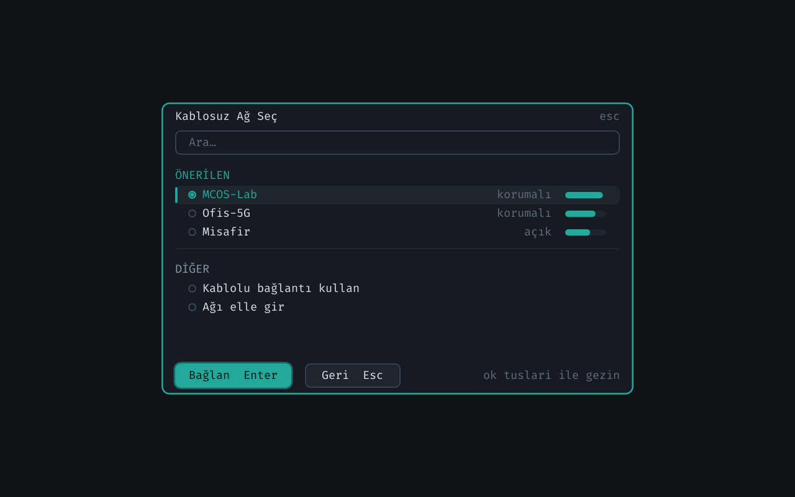
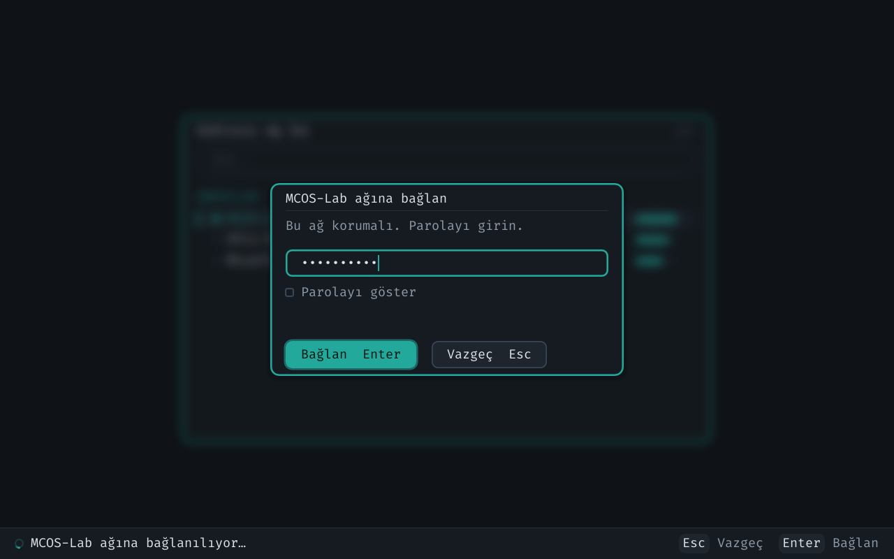
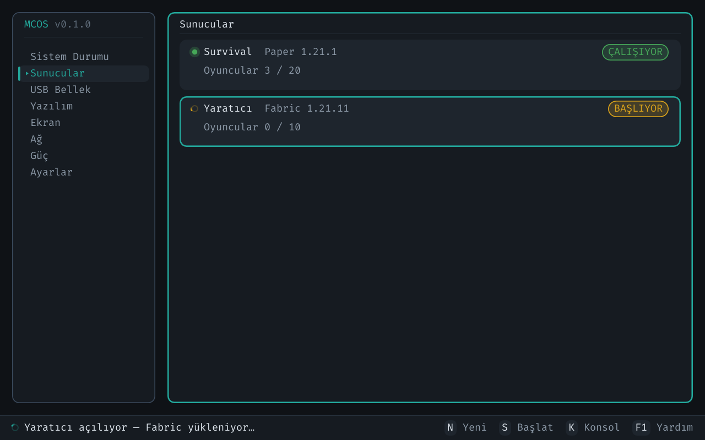
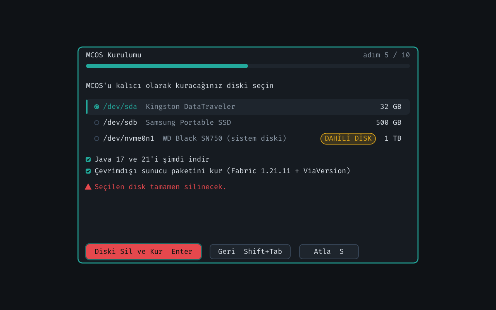
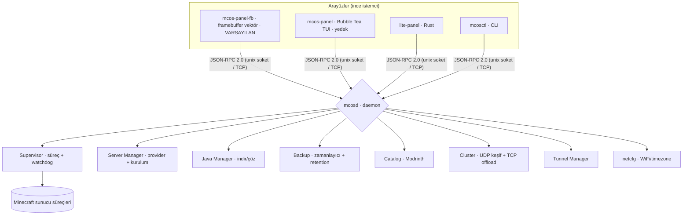
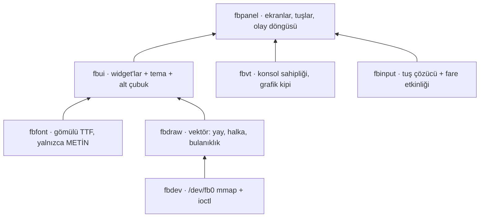

<div align="center">

# 🟧 MCOS — Minecraft Server OS

**Yalnızca Minecraft sunucuları yönetmek için tasarlanmış özel bir Linux dağıtımı.**

GUI yok, şişkinlik yok, dikkat dağıtacak hiçbir şey yok — sadece bir USB'ye yazıp boot ettiğiniz, açılır açılmaz sizi bulut kalitesinde bir sunucu paneliyle karşılayan saf bir sunucu işletim sistemi.


<br>


<sub><i>MCOS paneli — 1920×1080. Buradaki hiçbir çerçeve, çizgi veya işaret karakterle çizilmemiştir.</i></sub>

</div>

---

## 📑 İçindekiler

- [MCOS Nedir?](#-mcos-nedir)
- [Arayüz](#-arayüz)
- [Öne Çıkan Özellikler](#-öne-çıkan-özellikler)
- [Mimari](#️-mimari)
- [Durum ve Yol Haritası](#-durum-ve-yol-haritası)
- [Yaklaşık ISO Boyutu](#-yaklaşık-iso-boyutu)
- [ISO Derleme](#-iso-derleme)
- [USB'ye Yazma ve İlk Açılış (OOBE)](#-usbye-yazma-ve-i̇lk-açılış-oobe)
- [Sunucu Oluşturma Sihirbazı](#-sunucu-oluşturma-sihirbazı)
- [Eklenti / Mod Kataloğu](#-eklenti--mod-kataloğu)
- [PC Eşleştirme ve Güç Paylaşımı](#-pc-eşleştirme-ve-güç-paylaşımı)
- [İnternete Açma (Tünel)](#-i̇nternete-açma-tünel)
- [Temalar ve Kaynak Bütçesi](#-temalar-ve-kaynak-bütçesi)
- [Yedekleme ve Otomatik Kurtarma](#-yedekleme-ve-otomatik-kurtarma)
- [Geliştirici Rehberi](#-geliştirici-rehberi)
- [JSON-RPC API](#-json-rpc-api)
- [SSS](#-sss)
- [Lisans](#-lisans)

---

## 🎮 MCOS Nedir?

MCOS, bir Minecraft sunucusunu kurmak, çalıştırmak, izlemek, yedeklemek ve internete açmak için ihtiyaç duyduğunuz **her şeyi** içeren; bunun **dışında hiçbir şey** içermeyen bir işletim sistemidir.

- **Tek amaçlı (appliance):** Masaüstü, tarayıcı, ofis programı yok. Açılış doğrudan sunucu paneline düşer.
- **glibc tabanlı RootFS:** Temurin/Oracle JDK tarball'ları ek uğraş olmadan sorunsuz çalışsın diye `glibc` ile derlenmiştir.
- **Daemon merkezli:** Tüm iş `mcosd` (Go) tarafından yürütülür; arayüzler (TUI panel, hafif Rust panel, CLI) sadece JSON-RPC istemcisidir.
- **Taşınabilir:** Diski/USB'yi başka bir PC'ye taktığınızda donanım değişikliğini algılar ve ilk kurulum sihirbazını yeniden başlatır.

> [!NOTE]
> MCOS bir Minecraft *istemcisi* değildir — oyunu oynamak için kullanılmaz. Yalnızca **sunucu** tarafını yönetir.

---

## 🎨 Arayüz

MCOS'un arayüzü **doğrudan framebuffer'a** (`/dev/fb0`) çizilir. Arada terminal
öykünücüsü, pencere yöneticisi veya X11 yoktur.

### Neden bu kadar önemli?

Önceki sürüm bir **terminal** uygulamasıydı ve bu üç soruna yol açıyordu:

| Terminalde | MCOS'ta şimdi |
|---|---|
| Köşeler `╭ ─ ╮` karakterleriyle çizilir, font değişince **kopar** | Gerçek Bézier yayı — tek parça, kesintisiz |
| İkonlar fontta yoksa yedek fonta düşülür, **farklı genişlik satırı kaydırır** | İkonlar vektör çokgen — fonta hiç bağlı değil |
| Açılır pencerenin arkası **karartılamaz** (hücrenin "altı" yoktur) | Arka plan gerçekten bulanıklaşır |
| 16 renk yuvası, parlak tonlara yalnızca "bold" ile erişim | Tam **24 bit** renk |

Köşelerin gerçekten tek parça olduğu **testle kanıtlanır**: `TestStrokedRoundRectIsContinuous`
çerçevenin kapladığı *her* tarama satırında ve sütununda mürekkep arar;
`TestCornersAreActuallyRounded` ise kutunun tam köşe pikselinin **boş**, 45°'lik
yay noktasının **dolu** olmasını şart koşar.

### Ekranlar

<div align="center">

**Seçim ekranı** — Wi-Fi, disk, sürüm seçimi hep bu düzeni paylaşır



<br><br>

**Açılır pencere** — arka plan *duruyor*, sadece bulanıklaşıp hafifçe koyulaşıyor



<br><br>

**Alt durum çubuğu** — solda ne olduğu, sağda o ekranın kısayolları



<br><br>

**Kurulum ekranı** — disk seçimi, uyarılar, çevrimdışı paket seçeneği



<br><br>

**Altı tema** — tema değişince *yalnızca vurgu rengi* değişir; tamam/uyarı/hata sabit kalır ki okunabilirlik bozulmasın


</div>

### Arayüzü kendiniz görün (donanım gerekmez)

```bash
go build -o /tmp/panel ./cmd/mcos-panel-fb
/tmp/panel --screenshot ekran.png --connect /yok.sock
```

Daemon çalışmıyorken örnek veriyle çizer — tasarımı gözden geçirmek için birebir.

### Klavye

Tuş atamaları önceki sürümle **aynıdır**; kas hafızası bozulmaz.

| Tuş | Etki |
|---|---|
| `↑` `↓` / `k` `j` | Gezin |
| `Enter` / `→` / `l` | Seç, aç, başlat/durdur |
| `Esc` / `←` / `h` | Geri |
| `Tab` | Kenar çubuğu ↔ içerik |
| `n` | Yeni sunucu |
| `s` / `x` / `r` | Başlat / durdur / yeniden başlat |
| `t` | Turbo |
| `g` | Güç menüsü (uyku, yeniden başlat, kapat) |
| `q` | Çıkış |
| **`F12`** | Eski panele dön (sorun çıkarsa kaçış yolu) |

---

## 🌟 Öne Çıkan Özellikler

| Alan | Özellik |
|------|---------|
| **İlk Kurulum (OOBE)** | 10 adımlı sihirbaz: tanıtım → sistem kontrolü → PC adı & WiFi → Java → diske kurulum → tema → kaynak bütçesi → PC eşleştirme → (atlanabilir) ilk sunucu → onay |
| **Sunucu Yazılımları** | Vanilla, Paper, Purpur, Spigot, CraftBukkit, Folia, Fabric, Forge, NeoForge, Quilt |
| **Sürüm Esnekliği** | Canlı sürüm listesi (Mojang) + elle giriş; **ViaVersion** ile eski istemci desteği |
| **Sunucu Sihirbazı** | Hızlı şablonlar, oyun ayarları (gamemode/zorluk/PvP/online-mode/maks oyuncu/whitelist/hardcore/MOTD), EULA onayı, otomatik indirme & kurulum |
| **Eklenti/Mod Kataloğu** | Modrinth API ile **anahtarsız** arama + tek tıkla kurulum (`plugins/`, `mods/`, `datapacks/`) |
| **PC Eşleştirme** | Aynı ağdaki MCOS cihazları otomatik keşfeder; güçlü PC sunucuyu çalıştırır, zayıf PC yedek/log/optimizasyon işlerini üstlenir |
| **Tünel** | Port açmadan dışarı erişim. Sunucu başlayınca tünel açılır, durunca kapanır. *(Serveo'dan playit'e geçiş sürüyor.)* |
| **Güvenlik** | Online-mode varsayılan açık; isteğe bağlı beyaz liste; WiFi parolaları `wpa_supplicant` ile yönetilir |
| **Kaynak Yönetimi** | Sunucu başına RAM/CPU tavanı (kaynak bütçesi); `nice`/CPU affinity ile öncelik; "tam performans" modu |
| **Dayanıklılık** | Çöken sunucuyu üstel backoff'la yeniden başlatan supervisor; RPC panic-recovery; panel↔daemon otomatik yeniden bağlanma |
| **Yedekleme** | Zamanlanmış otomatik yedek + saklama (retention); tam veya yalnız-dünya; tek tıkla geri yükleme |
| **6 Tema** | Grafit Teal, Noir Mor, Antrasit Turuncu, Antrasit Yeşil, Gece Kızılı, Kehribar Grafit — hepsi koyu, mavi-ağırlıklı değil |
| **Arayüz** | Framebuffer'a doğrudan vektör çizim: tek parça yuvarlak köşeler, açılır pencere arkasında gerçek bulanıklık, 24 bit renk, canlı durum çubuğu |

---

## 🏗️ Mimari



Yeni panelin kendi çizim yığını (aşağıdan yukarı):



- **Tek ikili beyin:** `mcosd` store, supervisor, java, server, backup, files, worlds, players, cluster, tunnel ve netcfg alt sistemlerini birbirine bağlar.
- **Sözleşme:** Protokol `internal/ipc` altında tek yerde tanımlıdır; daemon istemcisi `internal/ipcclient` içindedir ve **her iki panel de aynı istemciyi kullanır** (framebuffer paneli Bubble Tea'yi bağlamak zorunda kalmasın diye ayrı pakete taşındı).
- **Platform ayrımı:** OS'e özgü kod (`*_linux.go`) yalnızca hedefte derlenir; geliştirici makinesinde güvenli no-op'lar devreye girer; böylece proje Windows/macOS üzerinde de derlenip test edilebilir.
- **Font sözleşmesi:** Gömülü yazı tipi **yalnızca metin** çizer. Çerçeve, ikon, radyo düğmesi, onay kutusu ve oklar `fbdraw` tarafından vektör olarak çizilir. Sebep: fontta 11 arayüz glifi yoktu ve yedek fonta düşmek satır hizasını kaydırıyordu.

---

## 📊 Durum ve Yol Haritası

> Bu bölüm **dürüst** tutulur: çalışan ile devam eden ayrı yazılır.

### ✅ Çalışıyor

| | Ne |
|---|---|
| ✅ | **Framebuffer vektör arayüzü** — panel, buton, radyo, onay kutusu, ilerleme çubuğu, rozet, dönen gösterge |
| ✅ | **Açılır pencere arkası bulanıklık** (1080p'de ~50 ms, önbellekli) |
| ✅ | **Alt durum çubuğu** — canlı olaylar + ekrana özel kısayollar |
| ✅ | **6 tema**, çalışırken değişir ve kaydedilir |
| ✅ | **Türkçe klavye** — çekirdek düzeni uygular, `ığüşöç` sorunsuz |
| ✅ | **UEFI kernel panic düzeltildi** (EFISTUB geri dönüşü kaldırıldı) |
| ✅ | **1920×1080 çözünürlük** — ISO/USB/kurulu disk artık aynı listeyi kullanıyor |
| ✅ | **Güvenli kaçış yolu** — F12 veya kurtarma menüsünden eski panele dönüş |
| ✅ | Ekranlar: Sistem Durumu, Sunucular, Ağ, Performans, Donanım, Güç, Ayarlar |

### 🚧 Devam ediyor

| | Ne | Not |
|---|---|---|
| 🚧 | **Diskten çalışma** | Şu an sistem tamamen initramfs'te, yani RAM'de. `switch_root` mimarisine geçilecek. **En riskli iş.** |
| 🚧 | **Çevrimdışı sunucu** (Fabric 1.21.11 + ViaFabric) | Şu an her şey kurulum anında indiriliyor. Yük MCOS-DATA bölümüne tohumlanacak. |
| 🚧 | **playit tüneli** | Serveo kaldırılıp yerine gömülü, otomatik yapılandırılan playit gelecek. |
| 🚧 | **Turbo modunun gerçek etkisi** | Şu an büyük ölçüde görsel; cgroup/öncelik uygulaması eklenecek. |
| 🚧 | **Kalan bölümlerin taşınması** | Yazılım, USB Bellek, MCOS Paylaşım — şu an F12 ile eski panele yönlendiriyor. |
| 🚧 | **Kurulum sihirbazı mantık hataları** | Bilinen ve raporlanmış; bkz. `GECIS.md` §7.6. |

> [!WARNING]
> Yeni arayüz **gerçek donanımda henüz geniş çapta denenmedi**. Bir sorunla
> karşılaşırsanız kurtarma menüsünden **[5]** ile eski arayüze geçebilir veya
> `MCOS_PANEL=legacy` ortam değişkenini kullanabilirsiniz.

Ayrıntılı teknik devir notları: [`GECIS.md`](GECIS.md)

---

## 💾 Yaklaşık ISO Boyutu

ISO; bir Linux çekirdeği (`bzImage`), gzip'lenmiş bir `initramfs` (`rootfs.cpio.gz`) ve GRUB önyükleyiciden oluşur.

| Bileşen | Sıkıştırılmamış | ISO katkısı |
|---------|----------------:|------------:|
| Linux kernel (özel 6.6 config) | ~8 MB | ~8 MB |
| Go binarileri (`mcosd`+`mcos-panel`+`mcosctl`+`mcos-detect`) | ~17 MB | ~7 MB (gzip) |
| Gömülü yazı tipi (FiraCode Nerd Font) | ~4 MB | ~2 MB (gzip) |
| Temel rootfs (glibc, busybox, OpenSSH, wpa_supplicant, e2fsprogs) | ~20–30 MB | ~9 MB (gzip) |
| GRUB + ISO (El Torito/xorriso) katmanı | — | ~10–16 MB |
| **Toplam `mcos-x86_64.iso`** | | **≈ 70–100 MB (tipik ~80 MB)** |

> [!TIP]
> initramfs tamamen RAM'e açılır; bu yüzden her megabayt hem ISO boyutu hem de çalışma anındaki bellek demektir. Diskten çalışma devreye girince bu kısıt büyük ölçüde kalkacak (bkz. Yol Haritası).

---

## 🧱 ISO Derleme

ISO üretimi **Linux tabanlı bir ortam** gerektirir (Ubuntu veya Windows üzerinde WSL2). Altyapı **Buildroot 2024.02**'dir.

### 1) Bağımlılıklar (tek seferlik)

```bash
bash scripts/setup-wsl.sh      # Go + Rust + QEMU + cpio/unzip/rsync/bc/xorriso ...
```

`scripts/setup-wsl.sh` çalıştıramıyorsanız Buildroot'un ihtiyaç duyduğu host araçlarını elle kurun:

```bash
sudo apt-get install -y cpio unzip rsync bc wget gawk bison flex file build-essential xorriso
```

> [!NOTE]
> Makefile bir **preflight** kontrolü içerir: eksik host aracı varsa derleme baştan, anlaşılır bir mesajla durur (eski "cpio/unzip bulunamadı" kriptik Buildroot hatası artık yaşanmaz). Şifresiz `sudo` mevcutsa eksikleri otomatik kurar.

### 2) Derle ve dene

```bash
make iso     # preflight → Go binarilerini linux/amd64 çapraz derler → Buildroot → dist/mcos-x86_64.iso
make qemu    # üretilen ISO'yu QEMU'da seri konsolla (-nographic) boot eder
```

> [!IMPORTANT]
> Buildroot ilk derlemede bir araç zinciri kurar; bu işlem **~10–15 GB boş disk** ve internet bağlantısı ister. `/mnt/c` üzerinde fakeroot/symlink sorunları çıkarsa native WSL diskine yönlendirin:
> ```bash
> make iso BR_OUTPUT=$HOME/mcos-output
> ```

---

## 🚀 USB'ye Yazma ve İlk Açılış (OOBE)

Oluşan `dist/mcos-x86_64.iso` dosyasını **Rufus** veya **BalenaEtcher** ile bir USB belleğe yazıp hedef PC'de başlatın.

İlk açılışta (veya disk/USB başka bir donanıma takıldığında) **10 adımlı kurulum sihirbazı** çalışır:

1. **Tanıtım** — MCOS'in ne yaptığına dair kısa karşılama.
2. **Sistem Kontrolü** — algılanan CPU/RAM/disk/GPU ve ağ durumu (salt-okunur özet).
3. **Kimlik + WiFi** — PC adı; yakındaki ağları **tarar** (🔒 + sinyal %), SSID + parola ile **gerçekten bağlanır** (`wpa_supplicant` + DHCP).
4. **Java** — kurulu Java yoksa **Java 21'i otomatik indirip kurar**.
5. **Tema** — 5 koyu tema arasından seçim; renkler **anında** önizlenir.
6. **Kaynak Bütçesi** — sunucu başına maks RAM ve CPU tavanı (yeni sunucular bu sınırı aşamaz).
7. **PC Eşleştirme** — cluster aç/kapa + keşfedilen MCOS cihazlarını listeler.
8. **İlk Sunucu (atlanabilir)** — "Şimdi kur" derseniz onaydan sonra sunucu sihirbazı otomatik açılır.
9. **Onay** — her şey kaydedilir, WiFi uygulanır, tema devreye girer.

> [!NOTE]
> **"Farklı PC → kurulum" nasıl çalışır?** Kurulumda makinenin ağ kartı MAC adreslerinden bir **donanım parmak izi** üretilip kaydedilir. Açılışta `mcosd` bu parmak izini mevcut donanımla karşılaştırır; uyuşmuyorsa (USB yeni bir PC'ye takılmış demektir) sihirbazı yeniden başlatır. Aynı PC'de doğrudan ana panel açılır.

Ana ekran sade tutulur: üstte **"＋ Yeni Sunucu (n)"**, altında sunucu listesi. Bir sunucuya `Enter` ile girip konsol, oyuncular, dosyalar, dünyalar, yedekler ve eklenti sekmelerine ulaşırsınız.

---

## 🧩 Sunucu Oluşturma Sihirbazı

Panelde `n` ile açılır. Adımlar:

1. **Şablon** — `Survival (Paper)`, `Yaratıcı (Fabric)`, `Vanilla`, `Anarşi (Paper)`, `Hardcore (Vanilla)` veya `Özel`. Şablon makul varsayılanları doldurur.
2. **Ad / açıklama**
3. **Sürüm** — canlı Mojang listesinden seçin ya da elle yazın (eski sürümler için) + **ViaVersion** anahtarı.
4. **Altyapı** — Paper/Fabric/… (eklenti mi mod mu desteklediğini gösterir).
5. **Ağ** — port (0 = otomatik boş port), render distance, simulation distance.
6. **Oyun Ayarları** — `online-mode`, oyun modu, zorluk, PvP, **maks oyuncu**, beyaz liste, hardcore, MOTD.
7. **Kaynak** — RAM, CPU kotası, **algılanan GPU bilgisi**, PC paylaşım.
8. **Kurulum Yeri** — özel dizin (boş = varsayılan) + otomatik başlat / otomatik yedek / tünel anahtarları.
9. **EULA** — Mojang Son Kullanıcı Lisans Sözleşmesi onayı (kabul etmeden ilerlenemez).
10. **Onay** — onaydan sonra yazılım **arka planda otomatik indirilip kurulur**; `eula.txt` ve `server.properties` (port, mesafeler, oyun modu, zorluk, online-mode, PvP, maks oyuncu, MOTD, hardcore, beyaz liste) yazılır. ViaVersion açıksa eklenti sunucularına `plugins/` içine indirilir.

---

## 📦 Eklenti / Mod Kataloğu

Sunucu detayında **Yazılım/Eklentiler** sekmesi, anahtar gerektirmeyen **Modrinth API** üzerinden arama yapar:

- Sunucunun altyapısına ve sürümüne göre **uyumlu** sonuçlar filtrelenir.
- Tek tuşla kurulum: dosya doğru klasöre iner — eklenti sunucusunda `plugins/`, mod loader'da `mods/`, diğerinde `world/datapacks/`.
- Tek tıkla **sürüm/altyapı değiştirme** (`server.changeVersion`): önce otomatik yedek alır, uygun Java sürümünü çözer, dünyayı koruyarak yeniden kurar.

---

## 🔗 PC Eşleştirme ve Güç Paylaşımı

Aynı ağdaki MCOS cihazları UDP ile birbirini otomatik keşfeder. Eşleşen iki düğümden:

- **Game Host** (güçlü olan) Minecraft sunucusunu çalıştırır.
- **Helper** (boştaki diğeri) yedekleme, log analizi ve optimizasyon gibi yan işleri üstlenir.

İş paylaşımı sahte değildir: helper, kendisine devredilen görevi gerçekten yürütür ve sonucu host'a geri döner (`internal/cluster` + `internal/daemon/executor.go`). Bir sunucuyu oluştururken **PC paylaşım** anahtarını açarsanız o sunucunun ağır yan işleri uygun bir helper'a devredilir; helper yoksa işler yerelde çalışır (graceful degradation).

---

## 🌐 İnternete Açma (Tünel)

Sunucunuzu port yönlendirme yapmadan internete açmak için MCOS bir **tünel**
kullanır. Böylece modem ayarlarına dokunmanız gerekmez.

> [!IMPORTANT]
> **Bu alan değişiyor.** Mevcut kod Serveo (`ssh -R`) kullanıyor; yerini
> **playit** alacak: OS imajına gömülü gelecek ve sunucu menüsünden tek adımda,
> kendi kendini yapılandırarak kurulacak. Geçiş tamamlanana kadar tünel
> bölümünü deneysel sayın.

Tünel açıkken sunucu dışarıdan erişilebilir bir adres alır; sunucu durunca
tünel de kapanır. İnternet yoksa özellik otomatik pasifleşir ve sunucu yerel
ağda normal çalışmaya devam eder.

---

## 🎨 Temalar ve Kaynak Bütçesi

<div align="center">

</div>

**6 koyu tema** (hiçbiri mavi-ağırlıklı değil): `Grafit Teal` (varsayılan),
`Noir Mor`, `Antrasit Turuncu`, `Antrasit Yeşil`, `Gece Kızılı`,
`Kehribar Grafit`. Tema kurulum sırasında veya **Ayarlar** bölümünden seçilir,
anında uygulanır ve `config.json`'a yazılır.

Tema değiştiğinde **yalnızca vurgu rengi** değişir — "tamam / uyarı / hata"
renkleri sabit kalır. Böylece hangi temayı seçerseniz seçin durum bilgisi aynı
netlikte okunur.

**Kaynak bütçesi** kurulumda belirlenir: sunucu başına maks RAM (MB) ve maks CPU payı (%). Daemon, yeni sunucu oluştururken ve başlatırken bu tavanları uygular; aşan değerler sessizce kısılır.

---

## 💽 Yedekleme ve Otomatik Kurtarma

- **Zamanlanmış yedek:** Sunucu başına süre (`6h` gibi) ve saklama sayısı (`Keep`). Daemon zamanı gelince yedek alır, en eskileri budar.
- **Tür:** Tam veya yalnız-dünya. Tek tıkla geri yükleme (`backup.restore`).
- **Watchdog:** Çöken süreç üstel backoff ile yeniden başlatılır (maks deneme + soğuma).
- **Panic-recovery:** Tek bir RPC handler paniği daemon'u düşürmez; hata olarak döner.
- **Reconnect:** Daemon yeniden başlasa bile panel çökmeden tekrar bağlanır.

---

## 🛠️ Geliştirici Rehberi

Proje Windows/macOS/Linux üzerinde derlenip test edilebilir (OS katmanı hariç).

```bash
# Tüm uygulamaları derle (host)
make app

# Testler + statik analiz
make test           # Go testleri
make vet
make test-boot      # önyükleme/kurulum/çözünürlük/panel mantığı (diske DOKUNMAZ)

# Arayüzü donanımsız görüntüle
go build -o /tmp/panel ./cmd/mcos-panel-fb
/tmp/panel --screenshot ekran.png --connect /yok.sock

# Widget mockup'larını üret
MCOS_UI_OUT=/tmp/ui go test ./internal/fbui/ -run TestMockup

# Yerel dev: daemon + panel
./bin/mcosd --data-root ./run --listen tcp://127.0.0.1:7777 &
./bin/mcos-panel --connect tcp://127.0.0.1:7777
./bin/mcosctl --connect tcp://127.0.0.1:7777 status
```

> [!WARNING]
> **`go build ./...` KULLANMAYIN.** ISO bir kez derlendikten sonra
> `os/buildroot/output/build/*/gcc/testsuite` altında binlerce geçersiz `.go`
> dosyası oluşur ve derleme baştan kırılır. Makefile'daki
> `GO_PKGS := ./cmd/... ./internal/... ./panel/...` kapsamı kullanılmalıdır.

**Dizin yapısı (özet):**

```
cmd/            mcosd, mcos-panel, mcos-panel-fb, mcosctl, mcos-detect
internal/       daemon, ipc, ipcclient, model, store, server(+providers),
                java, supervisor, backup, files, worlds, players, cluster,
                tunnel, catalog, netcfg, sysmon, tier, log, portmgr
  ├─ fbdev/     framebuffer aygıtı (/dev/fb0 mmap + ioctl)
  ├─ fbfont/    gömülü TTF ile metin çizimi (YALNIZCA metin)
  ├─ fbdraw/    vektör çizim: yuvarlak köşe, halka, çokgen, bulanıklık
  ├─ fbui/      widget'lar, tema, alt durum çubuğu, açılır pencere perdesi
  ├─ fbvt/      sanal terminal sahipliği (grafik kipi + güvenli geri verme)
  ├─ fbinput/   tuş çözücü (Türkçe UTF-8, kaçış dizileri) + fare etkinliği
  └─ fbpanel/   ekranlar, tuş atamaları, olay güdümlü döngü
panel/          Bubble Tea TUI (yedek arayüz)
lite-panel/     Rust hafif panel
os/buildroot/   Buildroot external tree (defconfig, paketler, init, overlay)
scripts/        derleme + test betikleri, lib/display.sh (çözünürlük tanımı)
docs/           gorseller/ (ekran görüntüleri), arastirma/ (analiz çıktıları)
```

**Test betikleri** (`make test-boot` hepsini çalıştırır):

| Betik | Neyi korur |
|---|---|
| `test-boot-logic.sh` | UEFI kernel panic'in geri gelmemesi, GRUB prefix ↔ grub.cfg uyumu |
| `test-display-logic.sh` | Çözünürlüğün ISO/USB/kurulu diskte aynı kalması |
| `test-panel-wiring.sh` | Yeni panelin gerçekten bağlı olması + konsolun geri verilmesi |
| `test-install-logic.sh` | Kurulum betiğinin mantığı |
| `test-bootloader-embed.sh` | Gömülü GRUB imajlarının bütünlüğü |
| `test-disksig.sh` | MBR imzası → PARTUUID dönüşümü |

> [!IMPORTANT]
> OS'e özgü davranışlar (WiFi, CPU affinity, timezone) yalnızca `linux` derleme etiketiyle gerçek iş yapar; diğer platformlarda no-op'tur. Bu yüzden Windows'ta `go build/test` yeşildir ama gerçek WiFi/affinity yalnızca cihazda devrededir. Race testi (`-race`) gcc gerektirdiğinden WSL/Linux'ta çalıştırılmalıdır.

---

## 🔌 JSON-RPC API

Tüm arayüzler newline ile ayrılmış JSON-RPC 2.0 konuşur. Önemli metotlar:

| Grup | Metotlar |
|------|----------|
| Sistem | `ping`, `system.status`, `config.get`, `config.set` |
| Sunucu | `server.list/get/create/delete/install/start/stop/restart/command/console`, `server.changeVersion`, `server.versions` |
| Katalog | `catalog.search`, `catalog.install` |
| Java | `java.list/install/resolve/remove/detect` |
| Yedek | `backup.list/create/restore/delete` |
| Dosya/Dünya | `files.list/read/write/delete`, `worlds.list/rename/delete` |
| Oyuncu | `players.list`, `players.command` |
| Cluster | `cluster.peers/pair/tasks` |
| Ağ | `net.wifiScan`, `net.wifiApply` |
| Tünel | `tunnel.list/create/resolve/start/stop` |

---

## ❓ SSS

**ISO ne kadar yer kaplar?** Tipik olarak ~80 MB. Bkz. [ISO Boyutu](#-yaklaşık-iso-boyutu).

**Eski sürüm istemcileri bağlanabilir mi?** Evet — sürüm adımında **ViaVersion**'ı açın (Paper/Spigot tabanlı sunucularda).

**İnternet yoksa ne olur?** Sürüm listesi yerel yedek listeye düşer, tünel pasifleşir; sunucular ve yerel özellikler çalışmaya devam eder. *(Tamamen çevrimdışı sunucu KURULUMU üzerinde çalışılıyor — bkz. Yol Haritası.)*

**Diski başka PC'ye taktım, ne olur?** Donanım parmak izi uyuşmadığı için kurulum sihirbazı yeniden başlar; ağ/WiFi yeniden ayarlanır.

**`make iso` "cpio bulunamadı" diyor.** `bash scripts/setup-wsl.sh` veya `sudo apt-get install -y cpio unzip rsync bc ...` çalıştırın; Makefile preflight zaten eksikleri bildirir.

---

## 📄 Lisans

MIT. Gömülü yazı tipi FiraCode Nerd Font, SIL Open Font License 1.1 ile dağıtılır.
